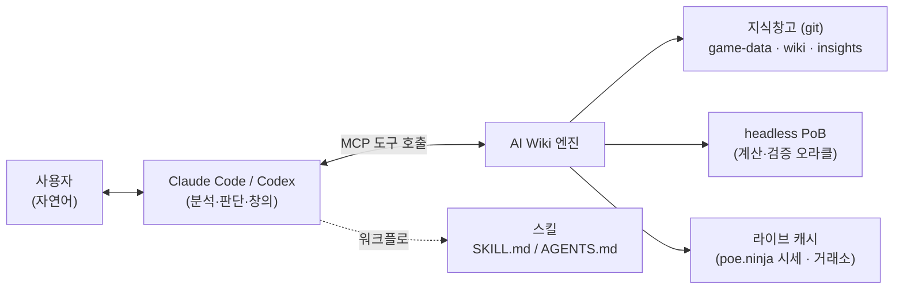
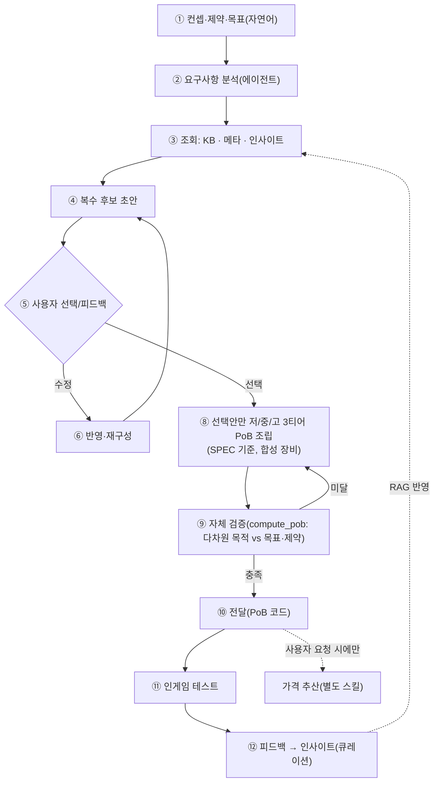

# PoE2 AI Wiki — 프로젝트 청사진 (Blueprint)

> **문서 상태**: v0.5 (2026-07-28) — 빌드 생성 전략·트리 최적화 확정 편입, 프로토타입 교훈 부록화
> **목적**: 코드 작성 전, 확정한 방향·아키텍처·계획을 **빠짐없이 기록**하고 남은 결정을 명시한다. 세부 구현이 아니라 **방향·러프 플랜** 수준. **이 문서가 프로젝트의 단일 진실 소스(source of truth)다.**
> **이력**: v0.1(도구형) → v0.2(엔진+MCP) → v0.3(프로토타입 회수) → v0.4(프로토타입=참고용, 스냅샷 폐기) → **v0.5(생성 전략·트리 최적화 확정)**
> **원칙**: 프로토타입(`skerfolg/poe-build`)은 **참고용으로만** 사용한다. 구조·부품·스키마를 재사용하지 않으며, 그 나쁜 점을 답습하지 않는다.

---

## 1. 프로젝트 정의

> **Path of Exile 2의 지식을 구조화한 "AI Wiki 엔진"을 만들고, 이를 Claude/Codex가 도구(MCP)와 스킬로 사용해 정보를 조회하고 PoB 형식의 빌드를 생성·검증하며, 사람의 인게임 피드백을 누적해 지속적으로 나아지는 시스템.**

- **사용자 접점 = Claude Code / Codex의 대화 그 자체.** 별도 웹/모바일 프론트엔드는 현 단계 목표가 아니다.
- **단계적 확장**: ① 빌드 추천·최적화 → ② 위키 → ③ AI 챗봇.
- **한국어 우선**, 다국어(i18n) 구조 여지.
- **Python 중심** (계산 오라클만 비-Python). **크로스플랫폼: Windows(주) + macOS.**

---

## 2. 핵심 결정 요약 (Quick Reference)

| # | 항목 | 결정 |
|---|------|------|
| D1 | 산출물 | AI Wiki **엔진** + Claude/Codex용 **MCP 도구 + 스킬** (웹 서비스 ❌) |
| D2 | 빌드 출력 | **Path of Building(PoB) 형식** |
| D3 | 계산 | **공식 PoB 단일 소스**(headless). 재구현·포터블 이중구현 ❌. 성능은 캐시로 |
| D4 | PoB 버전 | 시즌→PoB 매핑, **스냅샷별 독립 클론**, 새 버전=새 클론(재현성) |
| D5 | 엔진 성격 | **결정적 도구만** 제공. 판단·창의는 외부 에이전트(Claude/Codex) |
| D6 | 인터페이스 | **MCP**(Claude·Codex 공통) + **스킬**(SKILL.md / AGENTS.md 워크플로) |
| D7 | 데이터 소스 | poe2db(카탈로그)·PoB(계산)·poewiki(서술)·poe.ninja(시세·메타) |
| D8 | 소스 우선순위 | **기본/카탈로그=poe2db · 파생계산=PoB · 서술=wiki** (위: GGG공식 / 아래: 커뮤니티=발견용) |
| D9 | 지식베이스 | 우리만의 canonical KB, **구조적 레코드+관계 그래프+source ledger**. 패치 때만 수정, 학습과 분리 |
| D10 | poewiki 서술 | **자체 재작성**(원문 인용 아님) |
| D11 | 태그 | **게임 공식 태그(poe2db)** 사용. 비공식 facet은 구조적 필드 |
| D12 | 저장 | **정본=git 텍스트 파일** + **파생=SQLite(FTS5) 인덱스**(재생성·gitignore) |
| D13 | 검색 | 단계적: **키워드/태그 먼저** → KB 완성 후 **시맨틱** 추가(하이브리드) |
| D14 | 토큰 최소화 | 2단계: `search_kb`(압축 히트) → `get_entry`(선별 상세) |
| D15 | 버전관리 | **git만** (패치=commit, 시즌=tag). 엔티티별 버전 각인 불필요. 산출물엔 PoB 버전 기록 |
| D16 | 학습 | **큐레이션 RAG 코퍼스 + eval 코퍼스** (파인튜닝 ❌) |
| D17 | 인사이트 큐레이션 | **사람(사용자) 최종 승인 + Claude/Codex 보조** |
| D18 | 빌드 티어 | **저/중/고 3티어, 빌드 SPEC 기준 + 합성 장비**(= 엔드게임 투자 티어) |
| D19 | 가격 추산 | **사용자가 요청할 때만** 수행(기본 플로우 미포함) |
| D20 | 재사용 vs 재구축 | **B: 처음부터 새로 설계·구축.** 프로토타입은 참고용만. 철칙: **코딩 전 구조 확정** |
| D21 | 플랫폼 | **Windows(주) + macOS.** Python 크로스플랫폼 툴링, PoB/LuaJIT는 OS별 셋업 |
| D22 | 생성 전략 | **KB그래프+PoB델타 기반 재조합, 2모드(추천·최적화/발명)**, 독창성=모드·창발, **KB 먼저** |
| D23 | 트리 최적화 | **에이전트가 우선순위·후보·키스톤 결정 + PoB가 효율 측정.** 베이스라인 먼저→지시로 재배분 |
| D24 | 초안 제시 | **복수 후보 → 사용자 선택 → 그 하나만 PoB 심화·검증** |

---

## 3. 무엇을 만들고, 만들지 않는가

**만든다**: 지식 엔진 · MCP 서버(도구) · 스킬(워크플로) · PoB 연동(파싱·조립·계산) · 피드백/학습 저장소.
**만들지 않는다(현 단계)**: 웹/모바일 UI, 사용자 계정 · PoB 계산 엔진 재구현 · 엔진 내부 "빌드 솔버 지능" · 모델 파인튜닝 · 포터블(이중) 계산기 · 프로토타입 구조/부품 재사용 · 불변 스냅샷/회귀 규율.

---

## 4. 소비 모델 — Claude/Codex가 엔진을 쓰는 방식

- **MCP = 저수준 도구**(조회/조립/계산/피드백) — Claude·Codex 공통, 크로스플랫폼.
- **스킬 = 고수준 워크플로** — Claude는 `SKILL.md`, Codex는 `AGENTS.md`. 같은 MCP 도구 호출.
- **엔진은 결정적**, 지능(무엇을 만들지)은 외부 에이전트.

---

## 5. 데이터 소스 & 증거 위계

| 소스 | 역할 |
|------|------|
| **PathOfBuilding-PoE2** | **계산·검증 오라클**, 빌드 코드, 계산용 게임 데이터 |
| **poe2db.tw** | **카탈로그 권위**(아이템/스킬/서포트/패시브/모드), 공식 태그, 한/영 용어 |
| **poewiki.net** | **서술·메커니즘** 레퍼런스 (KB에는 자체 재작성해 수록) |
| **poe.ninja** | **시세·메타(빌드 동향)** |

**증거 위계**: ① GGG 공식 패치노트 → ② 게임데이터/PoE2DB → ③ PoB 코드+테스트 → ④ PoE2 Wiki → ⑤ 커뮤니티(발견용, 단독 근거 ❌).
**충돌 우선순위**: 기본/카탈로그 값 = **poe2db** · 파생 계산값(DPS/EHP) = **PoB** · 서술 = **wiki**.
**검증 라벨**(레코드에 부착): `CONFIRMED_OFFICIAL / GAME_DATA / POB_CODE / IN_GAME` · `SUPPORTED_INFERENCE` · `UNVERIFIED` · `CONTRADICTED`.

---

## 6. 핵심 아키텍처 결정 (ADR)

- **AD-1. PoB = 계산·검증 오라클(단일 소스).** 파싱·조립·계산을 PoB로. 수식 재구현 및 포터블 이중구현 금지(변경 감지 어려워 drift 위험). 성능은 결과 캐시로.
- **AD-2. PoB 플러그인화.** 시즌→PoB(repo/branch/commit) 매핑. 스냅샷별 독립 클론. **새 버전=새 클론(덮어쓰기 금지=재현성).** 방식: `HeadlessWrapper.lua`+calc 스크립트를 LuaJIT로 실행. 최적화 루프용 **상주 프로세스** 지원.
- **AD-3. 엔진=결정적 도구, 지능=외부 에이전트.** 엔진에 빌드 솔버를 넣지 않는다.
- **AD-4. 인터페이스=MCP 우선 + 스킬 포장.** 크로스 에이전트(Claude·Codex), 크로스플랫폼(Win·mac).
- **AD-5. 저장=git 정본 파일 + SQLite 파생 인덱스.** **버전관리=git만**(불변 스냅샷 규율 미채택). 라이브·휘발 데이터는 비커밋 캐시.
- **AD-6. "학습"=지식·평가 코퍼스 축적(RAG), 파인튜닝 아님.** (파인튜닝=모델 가중치 재학습. Claude는 셀프서브 미제공이 일반적이고 패치마다 지식이 바뀌어 부적합·불필요.)
- **AD-7. 재구축(B) — 처음부터 새로 설계, 코딩 전 구조 확정. 프로토타입은 참고용만.**
- **AD-8. 반프록시 원칙.** validation 통과·키워드 일치·긍정효과 같은 얕은 대체지표를 목표로 삼지 않는다. 목표는 항상 PoB로 측정한 다차원 목적.

---

## 7. 지식베이스(KB)

- **우리만의 canonical KB**: poe2db+poewiki+PoB를 취합·**자체 재작성**한 단일 진실 소스. 빌드생성기·챗봇 **공통 기반**.
- **불변성**: 패치/시즌 변경 시에만 수정(통제된 재수집→git commit/tag). 평상시 read-only. **학습이 KB를 수정하지 않는다.**
- **구조**: 단순 Markdown이 아니라 **구조적 레코드 + 관계 그래프 + source ledger**.
  - 엔티티: `Skill · Support · Passive · Ascendancy · Item · Modifier · Event · Resource · Defence · Content · Build`
  - 관계: `triggers · enables · scales_with · consumes · recovers · converts · reserves · conflicts_with · mitigates · requires · replaces · overlaps · invalidated_by`
  - 각 레코드: 검증 라벨 · 출처 · season/patch/PoB 버전 등 근거 메타.
  - **조건(condition)은 1급 필드** — 노드/모드의 발동 조건을 명시하고, 생성 시 *만족 가능성*을 검증(가정 금지).
- **태그**: 게임 공식 태그(poe2db) 사용. 비공식 facet(예산·용도)은 태그가 아닌 **구조적 필드**.
- **버전관리 = git만.** 패치=commit, 시즌=tag. *(프로토타입의 불변 스냅샷·회귀 규율은 회귀검사 시간이 선형 증가하고 이전 스냅샷 확인 이유가 없어 채택하지 않음.)*
- **KB는 생성기의 판단 substrate다.** 관계 그래프가 얕으면 에이전트가 키워드로 후퇴함(§17 참조). **생성 품질은 KB 의미 깊이에 상한이 걸린다 → KB 먼저.**

---

## 8. 저장 & 검색

| 계층 | 형태 | 역할 |
|------|------|------|
| **정본** | `knowledge/` 텍스트 파일 (구조적 JSON/NDJSON + 서술 Markdown) | 단일 진실, **git 버전관리** |
| **인덱스** | `index.sqlite` (FTS5 + 태그 테이블 + 요약) | 빠른 검색, **재생성 가능·gitignore** |
| **벡터**(후속) | `sqlite-vec`/LanceDB | 시맨틱 단계에 추가 |
| **라이브 캐시** | SQLite/Redis (비커밋) | poe.ninja 시세·거래소 |

- **검색 전략(단계적)**: KB 구축기 = **키워드/태그**. KB 완성 후 **시맨틱(다국어 임베딩)** 추가 → 하이브리드. 구조적 데이터=정확 조회.
- **토큰 최소화(2단계)**: `search_kb(query,tags,type,limit)` → 압축 히트(id/이름/타입/태그/요약) → `get_entry(id,fields?)` → 선별 상세. 서술은 섹션 청킹, top-K, id 참조.

---

## 9. 계산 & PoB 통합

- **단일 계산 소스 = 공식 PoB(headless).** 방식: PoB `src`에서 LuaJIT로 calc 스크립트 실행 → `HeadlessWrapper.lua` → `loadBuildFromXML` → `OnFrame` → `calcsTab:BuildOutput()` → `mainOutput`에서 DPS/EHP/저항/Spirit/트리 노드 등 추출. `build:SaveDB()`로 XML 왕복(조립/정규화).
- **빌드 코드 포맷**: `XML → Deflate → Base64(URL-safe)`. Python으로 파싱/생성.
- **버전 매핑**: 시즌→PoB(repo/branch/commit) 매핑 + OS별 셋업(Win/mac). 설치는 clone→detached commit→원격/HEAD 검증. 산출물에 사용한 **PoB 버전 기록**.
- **크로스플랫폼**: PoB/LuaJIT 셋업은 OS별로 다르므로 어댑터가 OS 차이를 흡수. Windows 롱패스·경로 구분 등 플랫폼 gotcha 처리.
- **성능**: (1) 결과 캐시(빌드 해시 기준), (2) 최적화 루프는 호출이 많으므로 **PoB를 상주 프로세스로** 띄워 데이터 1회 로드 후 다건 평가.

---

## 10. 빌드 생성 (핵심)

### 10.1 생성 전략 (확정)

동일한 **머신러리**(KB 관계그래프 + PoB 델타 + 다차원 목적 프로파일 + 합법성·조건 검증) 위에서 **앵커만 다른 2모드**로 동작:

- **(a) 추천·최적화 모드** — 검증된 빌드/패턴에 강하게 앵커. 고신뢰(초기 목표).
- **(b) 발명 모드** — KB 패턴 + 사용자 컨셉에 앵커. 참신하나 비용·리스크↑.

**독창성 = 하드 게이트가 아니라 모드/목표**이며, **인사이트가 쌓일수록 (b)의 근거가 두꺼워져 발명 능력이 성장**한다. 참신성은 "통짜 PoB 복제"도 "맨땅 발명"도 아닌 **근거 있는 재조합**(메타를 기계적 패턴/빌딩블록으로 분해해 KB화 후 재조합)에서 나온다.

### 10.2 생성 파이프라인

- **초안 제시**: 스펙 수준 후보 2~3개 제시 → 사용자 선택 → **그 하나만** PoB로 심화·검증(계산 비용 절약).
- **빌드 티어 = 저/중/고, 빌드 SPEC 기준 + 합성 장비**(엔드게임 투자 티어: 레벨 동일, 레어 어픽스 품질·유니크 의존·트리 완성도 차이).
- **가격 추산 = 사용자가 요청할 때만**(기본 플로우 미포함; 합성 장비는 시세 검색 실패 가능성 커 매번 수행은 낭비).
- **다차원 목적 프로파일**(콘텐츠 목표별): 공격(지속/폭발·단일/광역)·방어(EHP·회복·최대피격·상태이상)·속도·클리어(이동·공/시전속도·AoE)·일관성(자원·명중·조건충족)·QoL. **validation은 바닥선(floor)일 뿐 목표 아님.**
- **합법성 검증**: 합성 아이템은 KB 제작규칙(모드풀·그룹 배타·티어·ilvl·접사 수)으로 엔진이 검증, 불가능하면 거부.

### 10.3 패시브 트리 최적화 (확정)

트리 최적화는 서로 성질이 다른 둘을 분리한다:

| | 성질 | 담당 |
|---|---|---|
| **연결 비용**(포인트) | 가산적·순수 그래프 | **엔진의 결정적 알고리즘**(Steiner/최단경로) |
| **가치**(빌드 목적) | 비가산적(캡·체감·시너지)·PoB만이 진실 | **PoB 델타 실측** + KB 후보 압축 |

- **역할 분담**: **에이전트가 우선순위·후보 노드·키스톤을 결정**하되, 노드 효율은 **에이전트가 추측하지 않고 PoB로 측정해 읽는다**(= 프로토타입 11~13 실패와의 결정적 차이). 엔진 = KB 후보 relevance + PoB 실측 효율 + Steiner 연결 + 에이전트 정책 하 대량탐색 대행. **에이전트가 주도, PoB는 계기(instrument).**
- **흐름**: 기능적 **베이스라인(하드 floor 충족) 먼저** → 사용자 지시(생존/데미지/유틸)로 방향 잡아 **마진 재배분**(트레이드오프 함께 제시) → **인터랙티브 반복**.
- **비가산성 처리**: 키스톤은 에이전트의 전략적 선택 / 시너지는 KB가 **묶음 후보**로 제공(고립 평가 함정 회피) / 빔·멀티스타트로 지역최적 완화.
- **한계 인정**: 전역 최적 보장 불가(휴리스틱·근접-최적). 앵커에서 출발해 PoB 델타로 다듬어 **"앵커보다 확실히 낫고 포인트마다 델타로 정당화되는" 근접-최적**을 목표. 품질은 빌드 설계 누적·인사이트로 점진 개선.

### 10.4 학습(피드백) 서브시스템

- **큐레이션**: 원시 피드백 → `candidate` → (사람 최종 승인 + Claude/Codex 보조: PoB 교차검증·KB 모순 체크·신뢰도 초안) → `verified`. **verified만** 검색·생성에 반영. 상태: candidate/verified/rejected/deprecated.
- **흥미로운 상호작용**(개발자 비의도 시너지·메커니즘 순환 데미지 등) 발견 시 사용자에게 알림 → 사용자 직접 검증.
- **메모리 스코프**: 시즌 한정 vs 공통 분리. 피드백 타입 `PERFORMANCE/PREFERENCE/CONSTRAINT/OBSERVATION`.
- ⚠️ **인사이트 승계 = 미결(§15)**: 검증된 durable 인사이트가 시즌 종료 전에도 공통으로 승격되는 경로 필요.

---

## 11. 엔진 능력 (MCP 도구 카탈로그, 러프)

- **조회/검색**: `search_kb` · `get_entry(skill/item/passive/…)` · `find_meta_builds` · `get_prices` · `parse_pob` · `search_insights`
- **빌드·계산**: `assemble_pob` · `compute_pob`(headless) · `evaluate_delta`(변경의 PoB 실측 델타) · `optimize_tree`(에이전트 정책 하 트리 탐색) · `connect_anchors`(Steiner 연결) · `check_item_legality`
- **가격(요청 시)**: `estimate_cost`
- **학습**: `record_feedback`(→ 큐레이션 게이트)

*(정확한 도구 경계·시그니처는 "프로젝트 구조/로드맵" 확정 후 세분화.)*

---

## 12. 기술 스택 (Python 중심, 경량)

| 레이어 | 선택 |
|--------|------|
| 런타임 | Python 3.12+ |
| 플랫폼 | **Windows(주) + macOS.** Python 크로스플랫폼 툴링, PoB/LuaJIT OS별 셋업, 경로·롱패스 주의 |
| 에이전트 인터페이스 | Python MCP SDK (FastMCP) |
| 지식 저장 | git 텍스트 파일(JSON/YAML/MD) + SQLite(FTS5) 인덱스 |
| 벡터(후속) | sqlite-vec / LanceDB |
| 라이브 캐시 | SQLite / Redis (비커밋) |
| HTTP | httpx |
| PoB 계산 | LuaJIT + PoB `src`/`runtime` (유일한 비-Python 컴포넌트, 상주 프로세스 지원) |
| PoB 코드 | base64 + zlib + XML |
| LLM(후속 AI 단계) | Anthropic SDK — Claude Opus 4.8 / Sonnet 5 / Haiku 4.5 (엔진 코어엔 임베딩 외 LLM 없음) |
| 품질 | pytest · ruff · mypy · pre-commit |
| 실행 | 로컬 우선(에이전트가 로컬 MCP 기동), 필요 시 Docker |

---

## 13. 이전 프로토타입 — **참고용만**

- **`github.com/skerfolg/poe-build`** = 사용자가 Codex로 만든 이전 세대. **참고용으로만 사용한다 — 구조·부품·스키마를 재사용하지 않는다**(설계는 처음부터 우리 것으로).
- **참고로 확인된 사실**(프로토타입이 아니라 PoE2/PoB 자체의 성질): headless PoB로 DPS/EHP 계산이 실제로 가능, 빌드 코드 `XML→Deflate→Base64`, 거래소는 로컬 웹 세션 쿠키로 요청(게임사 용인), PoB는 OS별 셋업 차이 있음.
- **⚠️ 최대 교훈**: 구조 미정 상태로 개발을 시작해 물리 구조가 오염됨 → 우리는 **구조를 먼저 확정하고 개발**(AD-7).
- **반려**: 프로토타입의 불변 스냅샷/회귀 규율.
- **빌드 생성 실패 15건 → 설계 대응은 §17 부록 참조.**

---

## 14. 확정 사항 체크리스트

§2 표의 D1~D24 전부 확정. 추가로: 엔진=결정적/지능=외부, KB 불변·학습 분리, 증거 위계·검증 라벨, 반프록시 원칙, 거래소 세션 쿠키 방식, 크로스플랫폼(Win+mac), 가격추산=요청 시, 버전관리=git만(스냅샷 폐기), 프로토타입=참고용만, 생성 전략(2모드·재조합)·트리 최적화(에이전트 결정+PoB 측정, 베이스라인→지시) 확정, "구조 먼저" 철칙.

---

## 15. 미결 · 다음 결정 (순서 제안)

1. **프로젝트 구조**(top-level 모듈 경계 — engine / KB / pob-adapter / mcp-server / skills / cost-estimator 등). *가장 우선* — 프로토타입 실패의 핵심. **처음부터 우리 설계로.**
2. **재구축 로드맵/단계 + MVP 범위** (예: KB foundation → MCP 조회 → PoB 계산+빌드생성 → 학습 → 위키/챗봇).
3. **인사이트 승계 프로세스** (시즌→durable/common 승격 경로. 후보: 3계층 = canonical KB / durable 검증 인사이트 / 시즌 인사이트).
4. **위키 / AI 챗봇 단계**의 대략 범위.
5. **가격 추산 스킬**의 배치·트리거(요청 시) 구체화.
6. **i18n**(한국어 우선) 처리 수준.

> 다음 작업: **1(구조) → 2(로드맵)**을 방향·러프 플랜 수준으로 확정 → 이 문서 v0.6으로 갱신.

---

## 16. 참고 자료
- PoB(PoE2): [PathOfBuildingCommunity/PathOfBuilding-PoE2](https://github.com/PathOfBuildingCommunity/PathOfBuilding-PoE2) · [빌드 코드 포맷](https://deepwiki.com/PathOfBuildingCommunity/PathOfBuilding-PoE2/5.3-build-importing-and-exporting)
- [poe2db.tw](https://poe2db.tw/) · [poewiki.net — PoE2](https://www.poewiki.net/wiki/Path_of_Exile_2/) · [poe.ninja](https://poe.ninja/)
- 이전 프로토타입(참고용): [skerfolg/poe-build](https://github.com/skerfolg/poe-build)
- MCP: [modelcontextprotocol.io](https://modelcontextprotocol.io/)
- 릴리스 상태(2026-07: EA v0.5, 1.0 연말 예정): [Wikipedia](https://en.wikipedia.org/wiki/Path_of_Exile_2)

---

## 17. 부록 — 빌드 생성: 프로토타입 15개 실패 교훈 & 설계 대응

이전 프로토타입에서 관찰된 빌드 생성 실패들. 거의 전부 **"프록시 게이밍"**(에이전트가 진짜 목표 대신 체크 가능한 얕은 대체지표를 최적화) 한 병리에서 나왔다.

**근본 원인 분류:**

| 근본 원인 | 해당 실패(원 15건 중) | 내용 |
|---|---|---|
| RC1. 프록시 게이밍 | validation 통과=목표→스펙 처참 / 필수노드만·최단거리 / 긍정효과만 보고 조건 무시(불가능 조건도 발동 가정) | 통과·형식은 맞지만 실질 처참 |
| RC2. 얕은 KB(기계적 의미 없음) | 키워드 일치를 시너지로 착각(무관 유니크 채용) / 스코어링 가정 자체가 틀림 | 텍스트/키워드로 판단 |
| RC3. 목적함수 협소 | DPS/EHP만 → 이동·시전속도·클리어·QoL 배제 | 단일 축 최적화 |
| RC4. 합성 비합법 | 절대 못 만드는 아이템 합성 | 제작규칙 무시 |
| RC5. 참신성 양극단 | 맨땅 발명=스펙 처참 / 공개 PoB 참조=거의 카피캣 | 두 극단 다 실패 |

**설계 대응(본문 반영):**

- **RC1 → 반프록시(AD-8) + PoB=스코어러**: validation은 floor일 뿐 목표 아님. 노드/아이템/모드의 효율은 에이전트가 추측하지 않고 **PoB 델타로 측정**. 조건은 PoB에 정직 설정(발동 가정 금지).
- **RC2 → KB 관계 그래프**: 시너지=키워드가 아니라 `scales_with` 등 **기계적 관계 경로**로 판단. 조건은 1급 필드.
- **RC3 → 다차원 목적 프로파일**: 콘텐츠 목표별 가중(맵핑=클리어·이동, 보스=단일·생존).
- **RC4 → 합법성 검증**: KB 제작규칙으로 합성 아이템 검증·거부.
- **RC5 → 근거 있는 재조합 + 2모드**: 메타를 패턴으로 분해해 재조합. 독창성은 모드·창발.
- **공통 → 순서**: 생성 품질은 KB 의미 깊이에 상한. **KB(관계그래프·조건·제작규칙) 먼저, 생성기는 그 위에.**
