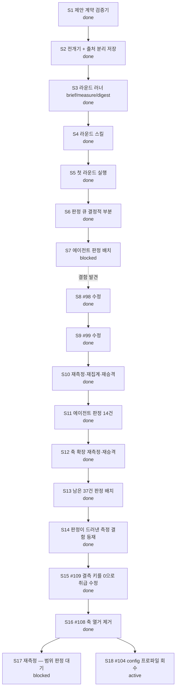

# Current Plan

**Status**: Active control document
**Policy**: [Workflow Governance](WORKFLOW-GOVERNANCE.md)
**History index**: [HISTORY-MAP.md](HISTORY-MAP.md)
**Integration branch**: `main`

This is the single live work-control document for the current repository lane. The structure of this file is enforced by `docs/WORKFLOW-GOVERNANCE.md` §12 (Live-Doc Schema) and §13 (Canonical Next Step Discipline) — the guard's `checkLiveDocSchema()` will validate this file on every precommit. Sections appear in the canonical order below; do not insert new H2 sections between CORE sections (consumer-specific sections must be appended after the last CORE section).

## Active Lane

Lane: `M5-proposal-rounds`

M5(3층 제안) — 반사실 캠페인의 창의 층. **무인 라운드 배치**로 짓는다: 사람이 루프의
동력이면 ①노가다 ②탐색이 사람 머릿속 상한에 갇힘 ③사용량에 기대면 축적 빈약, 셋이
무너진다(사용자 지시 2026-08-20). M3 캠페인을 수십 시간 무인으로 돌린 것과 같은 형태다.

사람은 **판정자**로만 남는다 — 정본 진입은 M6 큐레이션 게이트뿐이라 라운드가 아무리
돌아도 정본은 안 움직인다. 상세 설계는 [ROADMAP §M5 확정 설계](ROADMAP.md).

## Status Graph



## Baseline Structure

### M5-proposal-rounds

Status: `active`

Lane scope: 제안을 무인 배치로 생성·측정하고, 사람은 다이제스트만 판정한다.

| Sub | Subject | Status |
| --- | --- | --- |
| S1 | 제안 계약 검증기 — 3필드 강제·갭 라벨 (`engine/proposal.py`) | done |
| S2 | 전개기 + 출처 분리 저장 (`engine/proposal_flow.py`) | done |
| S3 | 라운드 러너 — brief·measure·digest (`engine/proposal_round.py`) | done |
| S4 | 라운드 스킬 `skills/proposal-round/` + 등록 shim | done |
| S5 | 첫 라운드 실행 → 다이제스트 판정 | done |
| S6 | 판정 큐 — 제공 축 분류·요구 기재·측정 경로 (결정적) | done |
| S7 | 에이전트 판정 배치 — 4건 시행 후 **중단**(측정 결함 발견) | blocked |
| S8 | #98 `<Slot active>` 수정 + 통합 시험 | done |
| S9 | #99 수정 — 오염 포함본 병기(`with_tainted`) | done |
| S10 | 재측정(2,689벌) → 재집계 → NodeValue 재승격 | done |
| S11 | 에이전트 판정 14건 — 큐 결함 3건·도구 결함 2건 발견 | done |
| S12 | #100 축 13개 재측정 → 재집계 → 재승격 · 큐 필터 전 축 반영 | done |
| S13 | 남은 판정 큐 37건 에이전트 배치 — 41건 저장, 「가치 없음」 0건 | done |
| S14 | 판정이 드러낸 측정 결함 등재 (#108~#111) | done |
| S15 | #109 수정 — 결측 키를 0.0으로 취급하는 가짜 델타 | done |
| S16 | #108 — 축 열거 제거. 하위 호환은 정본 샤드 바이트 동일로 확인 | done |
| S17 | 재측정 — **범위는 사용자 판정 대기**(전량 2,689벌 vs 판정 큐 노드만) | blocked |
| S18 | #104 config 프로파일을 main 직접 커밋에서 브랜치로 회수 | active |

## Canonical Next Step

The only next executable step is: **재측정 범위를 판정받는다 (S17).**

코드는 닫혔다(#109·#108). 남은 것은 **얼마나 다시 재느냐**이고 그건 판정이다:
전량(2,689벌 · 수시간)인가, 판정 큐에 걸린 노드만(훨씬 쌈)인가. 그리고 #110 —
PoB가 꺼 놓은 트리거·미라주를 되살릴 것인가(⚠ 상류가 왜 껐는지 모른다).

## Deferred Candidates

- `BI-stacking-axis-exploration` — 스태킹 축 탐색(공급 그래프 #91 기반, 전도성 룬·코스트
  스태킹 컨셉을 PoB 실측까지). **다른 세션이 활성으로 쓰던 레인이다** — 이 레인
  (`M5-proposal-rounds`)과 병합하며 여기로 옮겼다. 거버넌스는 활성 레인이 하나라
  둘을 동시에 못 싣는다. ⛔ 지우지 말 것: 그 세션이 돌아오면 여기서 이어받는다.

Pre-promotion lane candidates and Tier-4 follow-ups belong in a project-specific work backlog (e.g., `docs/WORK-BACKLOG.md`), not in this file. Replace this section's contents with a short list of named candidates when they exist:

```markdown
- `BI-feature-y` — short description (estimated effort, prerequisite, target version unassigned).
- `BI-feature-z` — short description.
```

This section is RECOMMENDED in `between-lanes` state (operators looking for "what's next" should find candidates here).

## Alternate Governance Actions

OPTIONAL. Use this section when the lane has named alternative paths beyond the Canonical Next Step (e.g., pause, fallback to a different lane, scope-extend). Each entry should name the alternative + when it would be chosen.

In the install state, the only alternative is "wait for a lane to be defined." No entry needed yet.

## Cleanup / Worktree Disposition

| Item | Status | Disposition |
| --- | --- | --- |
| CI 환경 가드 규약 | enforced | `tests/unit/test_integration_guards.py` — PoB 쓰는 통합 시험에 `skipif` 강제(내 시험이 CI를 깨뜨린 뒤 도입) |
| `artifacts/ingest-raw/proposals/0-5/` | active | 데이터 repo — 제안·전개·측정(파생). 정본 아님, 유지 |
| `artifacts/ingest-raw/counterfactual/0-5/removals-pre87/` | keep | #87 수정 전 1차분 — 대조·감사용 보관 |
| scratchpad `m4final`·`m4v2`·`m4v3` | disposable | 집계 대조용 임시 — 레인 종료 시 폐기 |
| worktree `.claude/worktrees/arc-measure` | unknown | 다른 세션 소유 추정 — **임의 삭제 금지**, 소유 세션 확인 후 처리 |
| worktree `.claude/worktrees/ecstatic-benz-b4d93c` | unknown | 위와 같음 |
| worktree `.claude/worktrees/zealous-dewdney-e94861` | unknown | 위와 같음 |
| branch `feat/m5-proposal-contract` | active | 이 레인의 작업 브랜치 — 머지 후 삭제 |
| branch `feat/long-jump-bundles` | unknown | 다른 세션 소유 추정 — 확인 후 처리 |

## Open Decisions

| Decision | Outcome | Date |
| --- | --- | --- |
| M5를 사람 트리거가 아니라 무인 라운드 배치로 | 배치 확정 — 사람은 판정자로만 | 2026-08-20 |
| 제안 3필드(메커니즘·전제·검증 경로)를 문서가 아니라 검증기로 강제 | `engine/proposal.py` | 2026-08-20 |
| 검증 경로 없는 제안을 배제하지 않고 **갭 라벨**로 보존 | 라벨 누적 = 다음 측정기 우선순위 | 2026-08-20 |
| 유형 할당량으로 스태킹 쏠림 방지 (가로등 밑 열쇠 찾기) | `TYPE_QUOTA` | 2026-08-20 |
| M4.5(메커니즘 그룹 조건)는 보류 — 홀드아웃 일반화 실패 | BACKLOG #89 · 재료 보존 | 2026-08-19 |
| 「측정 0 = 가치 없음」 전제 폐기 — 축을 못 잡은 것으로 재해석 | #97 · habit 판정 봉인 | 2026-08-20 |
| 기계적으로 안 되는 판정은 **에이전트**가 근거를 찾아 수행 (사용자에게 미루지 않음) | 근거 경로 필수 | 2026-08-20 |
| 에이전트 판정 배치를 중단하고 측정 결함부터 수정 | #98·#99 — 오염된 큐로 판정하면 판정도 오염된다 | 2026-08-20 |
| #94는 제외 대신 **병기**(with_tainted) — 축 단위 제외는 기각 | 주얼이 어느 축에 얹었는지 모르는 경우가 많다 | 2026-08-20 |
| 측정 축을 3 → 13개로 확장 | #100 — PoB가 이미 내보내는 값을 안 읽어 계열 전체가 0이었다 | 2026-08-21 |
| PoB 모델 갭 3건은 조치 불가로 기록만 | #101 — Jade·플라스크 가동률·투사체 수 | 2026-08-21 |
| Integration branch override — 작업 브랜치 `feat/96-umbrella-states` | **다른 레인**(`BI-stacking-axis-exploration`, 탐색 도구)의 작업이다. M5 레인과 파일이 겹치지 않아 병행했고, `origin/main`을 병합해 레인 구조는 M5(정본)를 따른다. 백로그 번호는 충돌을 피해 #102·#103으로 재발급했다. 이 PR 한정, 머지 시 소멸 | 2026-08-22 |
| Integration branch override — 작업 브랜치 `feat/m5-proposal-contract` | 레인명(`M5-proposal-rounds`)과 다름. 레인 승격 **전에** 브랜치를 열었고 PR이 이 이름으로 진행 중이라 유지. 이 레인 한정, 머지 시 소멸 | 2026-08-20 |
| 코스트 스태킹 컨셉 | **조건부 기각** — 동일 생명 예산에서 완드+래스피스에 x2.0~3.2 열세(슬롯 기회비용). 재평가 조건: 코스트 배수 합산 x2.5+ 확인 또는 +레벨급 코스트 무기 등장 | 2026-08-20 |
| 로우라이프 연계 | **제외** — 문턱 35% vs 시전당 코스트 10~17%로 산술 불성립. 판정 시점 논쟁은 이 산수로 무의미 | 2026-08-20 |
| 묠니르-전도성 룬 연계 | **불가 확정** — 천둥신의 진노 에너지 조건이 Melee 적중인데 전도성 룬에 Melee 타입 없음. 묠니르는 +레벨 스탯막대로만 가치 | 2026-08-20 |
| 판정 27건 중 「가치 없음」 **0건** — 0의 원인은 전부 측정기 쪽이었다 | #97 전제(「가치 없는 노드는 없다」)가 실측으로 확인됨 | 2026-08-22 |
| 축 확장을 「목록에 더 넣기」가 아니라 **열거 제거**로 간다 | #108 — 세 배치가 독립적으로 같은 결함에 도달했다. 목록은 강제 지점이 아니다(철칙 5) | 2026-08-22 |
| #109를 #108보다 **먼저** 고친다 | 결측→0.0 대체가 축을 넓히는 순간 가짜 델타를 대량 생산한다 | 2026-08-22 |
| PoB v0.23.1이 플레이어 트리거·미라주를 꺼 놓은 것 | #110 — 상류 상태. 되살릴지는 **사용자 판정**(상류가 왜 껐는지 모른다) | 2026-08-22 |
| Integration branch override — 작업 브랜치 `docs/108-measure-defects` | 레인명(`M5-proposal-rounds`)과 다름 — 이 PR은 측정 결함 등재·수정이라 레인 이름을 안 쓴다. ⚠ 처음엔 `feat/105-tool-gaps`(다른 세션) 위에서 분기했으나, **그 브랜치가 원격에 없어** 남의 미푸시 커밋이 실려 나가는 것을 피하려 `origin/main` 위로 리베이스했다. 백로그 #104~#107은 그 세션 몫으로 **비워 두었다**. 이 PR 한정 | 2026-08-22 |
| Canonical Next Step이 첫 미종결 항목(S7)과 다름 | S7은 **측정 결함 발견으로 중단**된 것이고 그 결함 연쇄(#98~#101·#108~#111)를 푸는 것이 S8~S16이다. S7은 결함이 닫힌 뒤 재개한다 | 2026-08-22 |
| config 프로파일 기본은 **빌드 원본 그대로** | #104 — 상태이상은 빌드 메커니즘에 달린 판단이라 엔진이 일괄로 못 켠다(일괄 시 +97.6% 부풀림). 액트 보상은 이미 복원본에 실려 온다 | 2026-08-22 |
| Integration branch override — 작업 브랜치 `feat/104-config-profiles` | #104 작업이 **`main`에 직접 커밋돼 있었다**(협업 규율 1 위반). 원격이 앞서가며 갈라져 로컬 main을 당길 수 없게 됐다 — 코드를 브랜치로 빼 `origin/main` 위에 다시 얹었다. 이 PR 한정 | 2026-08-23 |
| 냉기 주입 순환 컨셉 | **성립 가능 · 보류** — 수지·발동률 모두 흑자로 계산됨. 진행 전 해결 과제는 **쿨다운 병목 하나**(아래 §보류 컨셉 참조). 재개 조건: 쿨다운 회복 예산 100%+ 확보 경로 확인 | 2026-08-21 |
| 자로크의 봉기 컨셉 | **보류** — 쿨다운 10초가 최대 병목. 회복 265%로 상쇄하려면 무기·목걸이까지 유니크 강제라 슬롯 손실이 큼. 재평가 조건: 쿨다운 회복이 **다른 축과 공유**되는 구성 발견 시(냉기 주입 순환이 그 사례) | 2026-08-20 |

## Explicit Non-Actions

- Do not treat old roadmaps, drafts, or spike write-ups as active control unless this document explicitly reactivates them.
- Do not delete project documents before durable facts are absorbed into `HISTORY-MAP.md` or a closure artifact.
- Do not assign a release/version label to a lane up front; version assignment happens at release composition (`release compose`).
- Do not insert new H2 sections between the 9 CORE sections above (would fail the guard's `section-unknown-interleaved` check). Consumer-specific sections may be appended after `## Explicit Non-Actions`.

## 탐색 도구 (BI-stacking 레인 산출물)

M5 레인과 별개로 진행한 탐색 도구 작업. **파일이 겹치지 않아** 병행했고, 레인 구조는
M5(정본)를 따른다. 여기에는 **무엇이 생겼고 왜 생겼는지**만 남긴다.

| 도구 | 무엇을 막나 | 백로그 |
| --- | --- | --- |
| `kb/graph/mechanism.py::umbrella_relations` | 상위 상태(속박·연소)를 몰라 「공급이 마름」이라는 **없는 공백**을 보고하던 것 | #96 |
| `kb/graph/predicates.py::_NEGATION_BEFORE` | 극성 검사가 패턴마다 달려 안 단 패턴이 뚫리던 것(3번째 재발) | #96 |
| `kb/graph/scalers.py::scan_scalers` | **담체 개수를 배율 크기로 착각**하던 것(하루에 3번 반복) | #102 |
| (미해결) | 정본에 무기 계열 제약이 없어 **조용한 거짓 성립**이 나는 것 | #103 |

`scan_scalers` 적용 결과: 「X당 Y」 872건 → 획득 불가 260건 자동 배제 → 곱연산 88건 →
`player` 귀속·상한 제외 시 **61건**. 나머지는 게이지·횟수·희석·반경이었다.

## 보류 컨셉 (탐색 산출물)

빌드 설계 본체는 `artifacts/builds/<id>/design.md`(gitignore·미보존)라 사라진다. 여기에는
**다시 집어들 수 있을 만큼의 골자와 재개 조건만** 남긴다. 판정은 사용자 게임 지식 게이트다(AD-3).

### 냉기 주입 순환 (Ice Nova · CoEA×2 · Snap · 으스스한 기둥) — 2026-08-21

**한 줄**: 빙결 1회가 메타 젬 에너지·주입 잔류물·얼음 수정 기폭을 **동시에** 켜는 보스 특화 순환.

**배치** — 버튼 1~2개, 정신력 230 고정비

| 자리 | 담체 | 역할 |
| --- | --- | --- |
| 손 | Ice Nova (+얼음화살 병용) | 빙결 담당 · 냉기 주입 **소비자** · `Verglas` 부착처 |
| CoEA #1 (100) | **Snap** | 빙결 소모 → 얼음 수정 일제 기폭 + 잔류물 생성 + 유니크 50% more |
| CoEA #2 (100) | **Grim Pillars** | 룬 수호 소모 → 얼음 수정 8개 (상한 20) |
| 상시 (30) | Siphon Elements | 빙결마다 냉기 잔류물 (Power 20 → 100%) |

CoEA 2개는 `Absent Amulet`(변형 1)로 하나를 더 얻는다 — 대가는 접두·접미 각 −1.

**⛔ 최대 병목 — 쿨다운. 이걸 풀어야 Snap이 원활히 돈다.**

Snap의 기본 쿨다운 **4초**가 순환 전체의 회전수를 정한다. Snap이 빙결을 **걷어내야**
재빙결이 가능하므로(빙결은 중첩 불가·기본 4초), **빙결 주기 = Snap 주기**다. 즉 Snap이
느리면 공급·발동·버프가 **한꺼번에** 느려진다:

| 쿨다운 회복 | Snap 주기 | 냉기 잔류물/초 | +추가생성 40% | Archon 가동률 |
| ---: | ---: | ---: | ---: | ---: |
| 0% | 4.00초 | 0.50 | 0.70 | 50% |
| **100%** | 2.00초 | 1.00 | **1.40** | **100%** |
| 200% | 1.33초 | 1.50 | 2.10 | 100% |
| 265% | 1.10초 | 1.83 | 2.56 | 100% |

수요는 Ice Nova 냉기 1개/시전 = 1.00/초(기본 시전 1.0초). **쿨다운 회복 100% 미만이면
주입이 적자**고, 100%에서 흑자로 돌아서면서 `Elemental Archon`도 동시에 상시화된다.

이 축 하나가 네 곳에 걸린다: ①Snap 주기(공급률) ②빙결 빈도(CoEA 에너지) ③Archon 가동률
④Frost Bomb 쿨다운. 자로크의 봉기에서 "쿨다운 회복은 스킬 하나에만 걸려 값어치 없다"고
기각했던 것과 **정반대 구조**다.

**계산 근거 (도구 실측 2026-08-21)**

- `compute_trigger_rate`: CoEA는 동결에 **Power당 10 에너지**(감전·점화는 1). 유니크는 Power
  고정 20이라 빙결 1회 = **230 에너지**(품질 +15%). 소켓 2.6초(최대 260)도 매 빙결마다 찬다.
  일반 몹은 11.5/빙결이라 팩 AoE로 벌충한다 — **맵핑이 약하고 보스가 강한** 비대칭.
- `uptime`: Archon 지속 10초 / 회복주기 20초 → `required_cooldown_recovery` = **+100%**.
- 룬 수호는 병목이 **아니다**(초기 판단 철회): 정본 담체 조립 시 최대 2,355 → 재생 118/초,
  기둥 비용 81 → **초당 1.45회**(재생 접사 포함 2.18~2.91). 팩·희귀 발동률을 덮는다.

**아직 안 쓰이는 축 3종** (이 컨셉의 실제 신규성)

1. **얼음 수정 최대 생명력**이 숨은 딜 스탯 — `Verglas`가 *"파괴한 수정 최대 생명력 2,000당
   피해의 1%를 추가 냉기로"*. 기둥 만렙 9,536 × `Glacier`(100% more) × `Ice Walls`(200% inc)
   → 개당 **28~33%**. ⚠ 기둥 20개 **누적 여부는 정본에 없다(미판정)**.
2. **룬 수호 비용이 양방향 축** — `Verisium`은 *비어 있는 동안* 추가 화염 42~52%, 별도 접사는
   *비용 50당* 추가 번개 4~6%. 반대로 `Explosive Transmutation`은 비용 효율 +30%. CoEA가
   룬 수호를 자동으로 비우는 게 결함이 아니라 **기능**이다.
3. **주입 이종 강제** — 소비자 대부분이 다른 원소를 먹는다(스파크←냉기, 혜성←화염, 아크←번개).
   `Refracted Infusion`(수집 시 **다른** 원소 확정 1개)이 이 족쇄를 풀고, 잉여 이종은 CoEA
   소켓에 혜성·아크를 함께 넣어 소비한다(보스는 에너지 과잉이라 소켓 증설이 공짜).

**미검증 (진행 전 확인 필요)**

- `Verglas`는 *"Skills **you use yourself**"* — CoEA 트리거 Snap에는 안 붙을 수 있다.
  그래서 Verglas는 **Ice Nova에 붙이고 노바가 수정을 깨야** 한다는 게 현재 판단.
  (`Olroth's Hubris`·`Runic Infusion`은 *"use or Trigger yourself"*로 트리거를 **명시** —
  이 문구 차이가 판정 근거다.)
- 기하: 기둥은 **내 주변 4m**, Snap 적 폭발은 **적 위 1.6m**. 두 원이 겹쳐야 기폭된다 →
  밀착 시전 또는 Snap AoE 확장 필요.
- 기둥 *"80% less damage if destroyed within 0.5 seconds by something other than you"* —
  **사용자 확인 완료(2026-08-21): CoEA로 시전한 Snap은 「자기 자신」으로 판정된다. 문제 없음.**
- 벨트 3접두(`Glacial`/`Erupting`/`Energising`, 각 41~59%·서로 다른 group이라 공존 가능)는
  **PoB가 못 읽는다**(`pob_modeling.supported: false`) — `substitutes`로 추산해야 한다.
- 보스 빙결 축적을 목표 주기로 채울 수 있는지 **미측정**.

**재개 조건**: 쿨다운 회복 100%+ 예산이 다른 슬롯을 과하게 잡아먹지 않고 서는지 확인.
그다음이 얼음 수정 생명력 → `Verglas` 환산 실측.

### 몽크·철퇴 탐색 (Power 스태킹) — 2026-08-22 · **척추 불성립으로 보류**

**결론**: `Sadist's Mercy`의 Gruelling Madness(적 Power +10)는 **작동하지만 빌드 척추가
못 된다.** Power를 읽는 페이오프가 (a)대부분 게이지·횟수이고 (b)딜 계열은 `player` 귀속이라
공허의 형상에서 차단되며 (c)상한에 걸린다. `scan_scalers` 실측: `per Power` 곱연산 5건 중
3건이 프록시 차단, 배제 2건(`unused`·`carrier_unknown`).

**그래도 살릴 값어치가 있는 것** (Power와 무관하게 그 자체로 좋음):
- `Sadist's Mercy` — 물리 240~300% · 기본 치명타 13%급 · APS 1.8 (한손 철퇴)
- `Way of the Stonefist`(무술가) — 장갑을 돌주먹으로 변환: 카오스 **%전환**(고정 아님) ·
  레벨당 회피+3/ES+1 · 맹공 · 속성 요구 면제. **핵심 아이템을 강화하는 노드**
- `Way of the Mountain`(무술가) — **받는 피해 40% less**(Power는 중첩 수만 정함, 상한 30)
- `Hollow Form`(무술가) — 무기 스탯을 그대로 복사하는 딜 배수기. 사용자 실측: **사용감 좋음**,
  시전시간 긴 스킬일수록 이득(이미지가 코스트 80%로 대신 시전)
- 마무리 타격 임계치 — 보스 실효 딜 ×1.2~1.44 (전량 투자 시 유니크 4개 필요)

**확정된 사실 (인게임 실측)**:
- 공허의 형상: **무기 귀속 옵션은 통과**(Gruelling Madness 10/10 확인), **플레이어 귀속은
  차단**(광기의 선구자 발동 안 함)
- `Crushing Fear`는 **육척봉 전용** — 철퇴와 배타 (#98)
- 마무리 타격은 **유니크에도 걸린다**(임계 5%) · 단 일부 스크립트 보스는 예외
- `Glacial Cascade`는 **끝점 조준 문제로 실전성 낮음** — 범위(AoE)로 못 당기고,
  현재 버전이 근처 적을 강제 조준해 `Frozen Locus` 콤보를 방해한다(공식 포럼 불만 확인)

**재개 조건**: 「Power를 곱연산으로 바꾸는 담체」가 새로 나오면(시즌 갱신 등).
그전까지는 위 목록을 **평범하지만 저점 높은 무술가 철퇴 빌드**의 재료로만 쓴다.
