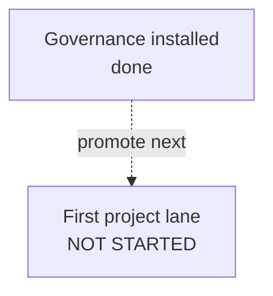

# Current Plan

**Status**: Active control document
**Policy**: [Workflow Governance](WORKFLOW-GOVERNANCE.md)
**History index**: [HISTORY-MAP.md](HISTORY-MAP.md)
**Integration branch**: `main`

This is the single live work-control document for the current repository lane. The structure of this file is enforced by `docs/WORKFLOW-GOVERNANCE.md` §12 (Live-Doc Schema) and §13 (Canonical Next Step Discipline) — the guard's `checkLiveDocSchema()` will validate this file on every precommit. Sections appear in the canonical order below; do not insert new H2 sections between CORE sections (consumer-specific sections must be appended after the last CORE section).

## Active Lane

Lane: `(none — between lanes after install)`

This scaffold ships in the `between-lanes` state. After running `workflow-governance init`, the project has the governance documents installed but has not yet promoted a project-specific lane.

To promote the first project lane:

1. Choose a lane identifier (kebab-case, version-unassigned — e.g., `BI-feature-x`, NOT `v0.1.0-feature-x`).
2. Replace the sentinel above with `` Lane: `<your-lane-id>` `` (real lane identifier — do not retain the parenthetical).
3. Populate `## Baseline Structure` with sub-task / phase rows.
4. Populate `## Canonical Next Step` with exactly one bolded actionable directive (per §13).
5. Run `npm run workflow:guard precommit` and confirm 0 errors.

Per §8 (Git and Worktree Hygiene), this lane targets the integration branch named in the header (`main` by default). If a different base is required, add an entry to `## Open Decisions` named "Integration branch override" with the override branch name, reason, and duration (single lane / until stated condition).

## Status Graph



## Baseline Structure

OPTIONAL in `between-lanes` state. When a lane is promoted, replace this section with a per-lane sub-task table:

```markdown
### <lane-identifier>

Status: `active`

Lane scope: <one-line intent>

| Sub | Subject | Status |
| --- | --- | --- |
| S1 | <first sub-task> | pending |
| S2 | <second sub-task> | pending |
```

Per §13.2 the baseline-matching algorithm uses the first Markdown table within this section to determine the "first unclosed item" for the Canonical Next Step mismatch check. The `Status` column must use values matching `/^(done|PASS)$/i` for closed rows.

## Canonical Next Step

The only next executable step is: **Promote the first project lane from a planning artifact and replace the sentinel in `## Active Lane`.**

When the lane is `active`, this section MUST contain exactly one bolded actionable directive (per §13.1). Multiple bolded list items or zero bolded items will fail the guard. In `between-lanes` state this section MAY be absent or MAY contain a sentinel directive like the example above.

## Deferred Candidates

Pre-promotion lane candidates and Tier-4 follow-ups belong in a project-specific work backlog (e.g., `docs/WORK-BACKLOG.md`), not in this file. Replace this section's contents with a short list of named candidates when they exist:

```markdown
- `BI-feature-y` — short description (estimated effort, prerequisite, target version unassigned).
- `BI-feature-z` — short description.
```

This section is RECOMMENDED in `between-lanes` state (operators looking for "what's next" should find candidates here).

## Alternate Governance Actions

OPTIONAL. Use this section when the lane has named alternative paths beyond the Canonical Next Step (e.g., pause, fallback to a different lane, scope-extend). Each entry should name the alternative + when it would be chosen.

In the install state, the only alternative is "wait for a lane to be defined." No entry needed yet.

## Cleanup / Worktree Disposition

| Item | Status | Disposition |
| --- | --- | --- |
| (none yet) | — | Record temporary worktrees, generated outputs, scratch files, and similar candidates here as they are created. Per §8 these must be resolved before lane closure. |

## Open Decisions

| Decision | Outcome | Date |
| --- | --- | --- |
| (none yet) | — | Record lane-affecting decisions here so future sessions can understand why the lane is shaped the way it is. Override entries (Canonical Next Step baseline-mismatch override per §13.1, or Integration Branch Override per §8) belong in this table. |

## Explicit Non-Actions

- Do not treat old roadmaps, drafts, or spike write-ups as active control unless this document explicitly reactivates them.
- Do not delete project documents before durable facts are absorbed into `HISTORY-MAP.md` or a closure artifact.
- Do not assign a release/version label to a lane up front; version assignment happens at release composition (`release compose`).
- Do not insert new H2 sections between the 9 CORE sections above (would fail the guard's `section-unknown-interleaved` check). Consumer-specific sections may be appended after `## Explicit Non-Actions`.
