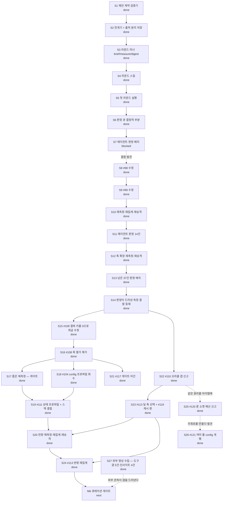

# Current Plan

**Status**: Active control document
**Policy**: [Workflow Governance](WORKFLOW-GOVERNANCE.md)
**History index**: [HISTORY-MAP.md](HISTORY-MAP.md)
**Integration branch**: `main`

This is the single live work-control document for the current repository lane. The structure of this file is enforced by `docs/WORKFLOW-GOVERNANCE.md` §12 (Live-Doc Schema) and §13 (Canonical Next Step Discipline) — the guard's `checkLiveDocSchema()` will validate this file on every precommit. Sections appear in the canonical order below; do not insert new H2 sections between CORE sections (consumer-specific sections must be appended after the last CORE section).

## Active Lane

Lane: `M5-proposal-rounds`

M5(3층 제안) — 반사실 캠페인의 창의 층. **무인 라운드 배치**로 짓는다: 사람이 루프의
동력이면 ①노가다 ②탐색이 사람 머릿속 상한에 갇힘 ③사용량에 기대면 축적 빈약, 셋이
무너진다(사용자 지시 2026-08-20). M3 캠페인을 수십 시간 무인으로 돌린 것과 같은 형태다.

사람은 **판정자**로만 남는다 — 정본 진입은 M6 큐레이션 게이트뿐이라 라운드가 아무리
돌아도 정본은 안 움직인다. 상세 설계는 [ROADMAP §M5 확정 설계](ROADMAP.md).

## Status Graph



## Baseline Structure

### M5-proposal-rounds

Status: `active`

Lane scope: 제안을 무인 배치로 생성·측정하고, 사람은 다이제스트만 판정한다.

| Sub | Subject | Status |
| --- | --- | --- |
| S1 | 제안 계약 검증기 — 3필드 강제·갭 라벨 (`engine/proposal.py`) | done |
| S2 | 전개기 + 출처 분리 저장 (`engine/proposal_flow.py`) | done |
| S3 | 라운드 러너 — brief·measure·digest (`engine/proposal_round.py`) | done |
| S4 | 라운드 스킬 `skills/proposal-round/` + 등록 shim | done |
| S5 | 첫 라운드 실행 → 다이제스트 판정 | done |
| S6 | 판정 큐 — 제공 축 분류·요구 기재·측정 경로 (결정적) | done |
| S7 | 에이전트 판정 배치 — 4건 시행 후 **중단**(측정 결함 발견) | blocked |
| S8 | #98 `<Slot active>` 수정 + 통합 시험 | done |
| S9 | #99 수정 — 오염 포함본 병기(`with_tainted`) | done |
| S10 | 재측정(2,689벌) → 재집계 → NodeValue 재승격 | done |
| S11 | 에이전트 판정 14건 — 큐 결함 3건·도구 결함 2건 발견 | done |
| S12 | #100 축 13개 재측정 → 재집계 → 재승격 · 큐 필터 전 축 반영 | done |
| S13 | 남은 판정 큐 37건 에이전트 배치 — 41건 저장, 「가치 없음」 0건 | done |
| S14 | 판정이 드러낸 측정 결함 등재 (#108~#111) | done |
| S15 | #109 수정 — 결측 키를 0.0으로 취급하는 가짜 델타 | done |
| S16 | #108 — 축 열거 제거. 하위 호환은 정본 샤드 바이트 동일로 확인 | done |
| S17 | 좁은 재측정(1,489벌·60분) — 게이트. 41종 중 **16종이 값을 냈다** | done |
| S18 | #104 config 프로파일을 main 직접 커밋에서 브랜치로 회수 (PR #96) | done |
| S19 | #111 — 상태 프로파일 3종 + 스택 결합. 4건 전수 검증 | done |
| S20 | 전량 재측정·재집계·재승격 — 전 축 0인 노드 936 → 583 (PR #104) | done |
| S21 | #117 수정 — 가정 게이트 어간 처리(과거분사 config vs 명사형 공급 문구) (PR #98) | done |
| S22 | #110 대응 — 되살리기 불가 확정, 오라클이 `POK_META`로 자기 갭 신고 (PR #99) | done |
| S23 | #113 — `CombinedDPS`가 속도를 잃는 조건을 신고·축 선택 (`engine/dps_axis.py`) + #119 캐시 판 번호 | done |
| S24 | #113 반영 재집계 — 속도 노드 **5종 부활** · 73노드 손실률 교정(양방향). 재측정 없이 정본만 갱신 | done |
| S25 | #120 — 아이템 룬 소켓 **예산**을 오라클이 신고(베이스/유니크 + 트리 부여), 조립은 PoB가 못 여는 6칸 초과만 거부하고 **우회로를 함께 낸다** (`pob/runner.py::socket_budget`) | done |
| S26 | #121 — 여러 줄 config가 `&#10;`로 나가 PoB에서 조용히 사라지던 것 수정 (`pob/buildxml.py::_pob_attr`) | done |
| S27 | 외부 영상 4편 전사 → 도구 갭 **#122~#126** 등재 · 인사이트 **4건** 승격. 사용자 판정 반영: `as-though-damage-scales-narrowly` → **SUPPORTED_INFERENCE**, 나머지 3건 UNVERIFIED 유지. **#123은 착수 전 코드 대조로 좁혔다** — 「전 경로」가 아니라 `optimize_items` 하나였다 | done |

## Canonical Next Step

The only next executable step is: **M6 큐레이션 게이트 설계.**

측정 층은 닫혔다. S20이 전량을 다시 쟀고(전 축 0인 노드 936 → 583), S23이 #113을 고쳤고,
S24가 그 수정을 정본에 반영했다(속도 노드 5종 부활 · 73노드 양방향 교정). 판정 41건 중
값을 못 낸 15종도 원인이 다 규명됐다(config 미점등 3 + PoB 모델 갭 12).

⛔ **이제 막힌 곳은 정본 진입 경로가 없다는 것이다.** 판정 41건이 쌓였는데 M6 큐레이션
게이트가 없어 정본은 안 움직인다. 라운드가 아무리 돌아도 사람이 판정자로만 남는 구조라
(Active Lane 참조) **정본 진입은 이 게이트 하나뿐**이다.

⚠ 게이트의 **범위·판정 기준은 사용자 합의가 필요하다**(철칙 1 — 구조 결정). 무엇을 정본에
태울지, 어떤 근거를 요구할지가 그대로 정본 품질이 된다.

## Deferred Candidates

- `BI-stacking-axis-exploration` — 스태킹 축 탐색(공급 그래프 #91 기반, 전도성 룬·코스트
  스태킹 컨셉을 PoB 실측까지). **다른 세션이 활성으로 쓰던 레인이다** — 이 레인
  (`M5-proposal-rounds`)과 병합하며 여기로 옮겼다. 거버넌스는 활성 레인이 하나라
  둘을 동시에 못 싣는다. ⛔ 지우지 말 것: 그 세션이 돌아오면 여기서 이어받는다.

Pre-promotion lane candidates and Tier-4 follow-ups belong in a project-specific work backlog (e.g., `docs/WORK-BACKLOG.md`), not in this file. Replace this section's contents with a short list of named candidates when they exist:

```markdown
- `BI-feature-y` — short description (estimated effort, prerequisite, target version unassigned).
- `BI-feature-z` — short description.
```

This section is RECOMMENDED in `between-lanes` state (operators looking for "what's next" should find candidates here).

## Alternate Governance Actions

OPTIONAL. Use this section when the lane has named alternative paths beyond the Canonical Next Step (e.g., pause, fallback to a different lane, scope-extend). Each entry should name the alternative + when it would be chosen.

In the install state, the only alternative is "wait for a lane to be defined." No entry needed yet.

## Cleanup / Worktree Disposition

| Item | Status | Disposition |
| --- | --- | --- |
| CI 환경 가드 규약 | enforced | `tests/unit/test_integration_guards.py` — PoB 쓰는 통합 시험에 `skipif` 강제(내 시험이 CI를 깨뜨린 뒤 도입) |
| `artifacts/ingest-raw/proposals/0-5/` | active | 데이터 repo — 제안·전개·측정(파생). 정본 아님, 유지 |
| `artifacts/ingest-raw/counterfactual/0-5/removals-pre87/` | keep | #87 수정 전 1차분 — 대조·감사용 보관 |
| scratchpad `m4final`·`m4v2`·`m4v3` | disposable | 집계 대조용 임시 — 레인 종료 시 폐기 |
| worktree `.claude/worktrees/*` (arc-measure·ecstatic-benz·zealous-dewdney) | **소멸** | 2026-08-24 확인: `.claude/worktrees` **디렉터리 자체가 없다**. 표만 남아 있었다 |
| worktree `.worktrees/ci-fix` (실제 경로는 다른 세션 scratchpad) | prunable | 실재하는 유일한 외부 워크트리 — 다른 세션(`3dee16c4`) scratchpad, detached `9eeb97e`(2026-08-13 「CI 복구 — mypy strict 17건」). **커밋은 main에 흡수 완료**(ancestor 확인)라 잃을 것이 없다. 가드가 「Current Plan에 없는 워크트리」로 경고하는 대상. **미커밋 변경 0건**(2026-08-24 확인)이라 지워도 잃을 것이 없다. ⛔ 그래도 소유 세션 확인 후 `git worktree remove` — 이 표에 적힌 것은 삭제 근거이지 삭제 승인이 아니다 |
| branch `feat/m5-proposal-contract` | **소멸** | 머지 후 삭제됨 — 로컬·원격 모두 없다 |
| branch `feat/long-jump-bundles` | stale | main이 #70을 PR #83으로 완결했고 `engine/tree/optimize.py`에 `long_jump`가 실재한다 — 이 브랜치는 **그 이전 작업분**이다. 로컬·원격 모두 잔존 · 삭제 후보 |
| 원격 브랜치 21개 | stale | 스쿼시 머지 뒤 안 지워진 잔재(`fix/restore-item-granted-groups` 등). 일괄 정리는 **사용자 판정** — 소유 세션을 특정할 수 없다 |

## Open Decisions

| Decision | Outcome | Date |
| --- | --- | --- |
| M5를 사람 트리거가 아니라 무인 라운드 배치로 | 배치 확정 — 사람은 판정자로만 | 2026-08-20 |
| 제안 3필드(메커니즘·전제·검증 경로)를 문서가 아니라 검증기로 강제 | `engine/proposal.py` | 2026-08-20 |
| 검증 경로 없는 제안을 배제하지 않고 **갭 라벨**로 보존 | 라벨 누적 = 다음 측정기 우선순위 | 2026-08-20 |
| 유형 할당량으로 스태킹 쏠림 방지 (가로등 밑 열쇠 찾기) | `TYPE_QUOTA` | 2026-08-20 |
| M4.5(메커니즘 그룹 조건)는 보류 — 홀드아웃 일반화 실패 | BACKLOG #89 · 재료 보존 | 2026-08-19 |
| 「측정 0 = 가치 없음」 전제 폐기 — 축을 못 잡은 것으로 재해석 | #97 · habit 판정 봉인 | 2026-08-20 |
| 기계적으로 안 되는 판정은 **에이전트**가 근거를 찾아 수행 (사용자에게 미루지 않음) | 근거 경로 필수 | 2026-08-20 |
| 에이전트 판정 배치를 중단하고 측정 결함부터 수정 | #98·#99 — 오염된 큐로 판정하면 판정도 오염된다 | 2026-08-20 |
| #94는 제외 대신 **병기**(with_tainted) — 축 단위 제외는 기각 | 주얼이 어느 축에 얹었는지 모르는 경우가 많다 | 2026-08-20 |
| 측정 축을 3 → 13개로 확장 | #100 — PoB가 이미 내보내는 값을 안 읽어 계열 전체가 0이었다 | 2026-08-21 |
| PoB 모델 갭 3건은 조치 불가로 기록만 | #101 — Jade·플라스크 가동률·투사체 수 | 2026-08-21 |
| Integration branch override — 작업 브랜치 `feat/96-umbrella-states` | **다른 레인**(`BI-stacking-axis-exploration`, 탐색 도구)의 작업이다. M5 레인과 파일이 겹치지 않아 병행했고, `origin/main`을 병합해 레인 구조는 M5(정본)를 따른다. 백로그 번호는 충돌을 피해 #102·#103으로 재발급했다. 이 PR 한정, 머지 시 소멸 | 2026-08-22 |
| Integration branch override — 작업 브랜치 `feat/105-tool-gaps` | **다른 레인**(`BI-stacking-axis-exploration`) — 탐색 중 발견한 도구 갭 3건(#105~#107) 등재. 문서만 바꾸므로 M5 레인과 충돌 없음. 백로그 번호는 본체 로컬의 미푸시 #104를 피해 #105부터 잡았다. 이 PR 한정 | 2026-08-22 |
| Integration branch override — 작업 브랜치 `feat/m5-proposal-contract` | 레인명(`M5-proposal-rounds`)과 다름. 레인 승격 **전에** 브랜치를 열었고 PR이 이 이름으로 진행 중이라 유지. 이 레인 한정, 머지 시 소멸 | 2026-08-20 |
| 코스트 스태킹 컨셉 | **조건부 기각** — 동일 생명 예산에서 완드+래스피스에 x2.0~3.2 열세(슬롯 기회비용). 재평가 조건: 코스트 배수 합산 x2.5+ 확인 또는 +레벨급 코스트 무기 등장 | 2026-08-20 |
| 로우라이프 연계 | **제외** — 문턱 35% vs 시전당 코스트 10~17%로 산술 불성립. 판정 시점 논쟁은 이 산수로 무의미 | 2026-08-20 |
| 묠니르-전도성 룬 연계 | **불가 확정** — 천둥신의 진노 에너지 조건이 Melee 적중인데 전도성 룬에 Melee 타입 없음. 묠니르는 +레벨 스탯막대로만 가치 | 2026-08-20 |
| 판정 27건 중 「가치 없음」 **0건** — 0의 원인은 전부 측정기 쪽이었다 | #97 전제(「가치 없는 노드는 없다」)가 실측으로 확인됨 | 2026-08-22 |
| 축 확장을 「목록에 더 넣기」가 아니라 **열거 제거**로 간다 | #108 — 세 배치가 독립적으로 같은 결함에 도달했다. 목록은 강제 지점이 아니다(철칙 5) | 2026-08-22 |
| #109를 #108보다 **먼저** 고친다 | 결측→0.0 대체가 축을 넓히는 순간 가짜 델타를 대량 생산한다 | 2026-08-22 |
| PoB v0.23.1이 플레이어 트리거·미라주를 꺼 놓은 것 | #110 — 상류 상태. 되살릴지는 **사용자 판정**(상류가 왜 껐는지 모른다) | 2026-08-22 |
| Integration branch override — 작업 브랜치 `docs/108-measure-defects` | 레인명(`M5-proposal-rounds`)과 다름 — 이 PR은 측정 결함 등재·수정이라 레인 이름을 안 쓴다. ⚠ 처음엔 `feat/105-tool-gaps`(다른 세션) 위에서 분기했으나, **그 브랜치가 원격에 없어** 남의 미푸시 커밋이 실려 나가는 것을 피하려 `origin/main` 위로 리베이스했다. 백로그 #104~#107은 그 세션 몫으로 **비워 두었다**. 이 PR 한정 | 2026-08-22 |
| Canonical Next Step이 첫 미종결 항목(S7)과 다름 | S7은 **측정 결함 발견으로 중단**된 것이고 그 결함 연쇄(#98~#101·#108~#111)를 푸는 것이 S8~S16이다. S7은 결함이 닫힌 뒤 재개한다 | 2026-08-22 |
| config 프로파일 기본은 **빌드 원본 그대로** | #104 — 상태이상은 빌드 메커니즘에 달린 판단이라 엔진이 일괄로 못 켠다(일괄 시 +97.6% 부풀림). 액트 보상은 이미 복원본에 실려 온다 | 2026-08-22 |
| Integration branch override — 작업 브랜치 `feat/104-config-profiles` | #104 작업이 **`main`에 직접 커밋돼 있었다**(협업 규율 1 위반). 원격이 앞서가며 갈라져 로컬 main을 당길 수 없게 됐다 — 코드를 브랜치로 빼 `origin/main` 위에 다시 얹었다. 이 PR 한정 | 2026-08-23 |
| 좁은 재측정을 전량 전의 **게이트**로 삼는다 | 41종 중 16종이 값을 냈고 예측한 축에서 나왔다 — 전량이 정당화됨. 안 나왔으면 수시간을 버릴 뻔했다 | 2026-08-23 |
| 상태(config)와 스택(결합)을 갈라 다룬다 | #111 — 상태는 상황이라 노드와 독립, 스택은 노드가 생산하므로 제거 시 0이 되어야 한다. 실측이 이 구분을 확인 | 2026-08-23 |
| `#101`의 「조치 불가」 2건을 정정 | `Endless Munitions`·`Enduring Elixirs`는 DPS엔 안 닿지만 `ProjectileCount`·ES 재생에서 보인다 — DPS만 보고 닫았던 것 | 2026-08-23 |
| Integration branch override — 작업 브랜치 `feat/111-config-coupling` | 레인명과 다름. #96 머지 후 `main` 위로 옮겼다. 이 PR 한정 | 2026-08-23 |
| #110 되살리기를 **불가로 확정** | 트리거·미라주 둘 다 `skillFlags`(nil)에서 크래시 — PoE2 이식 미완성. 우리 스냅샷이 이미 상류 dev HEAD라 승급 경로도 없다 | 2026-08-23 |
| 못 재는 것은 **오라클이 스스로 신고**하게 한다 | 철칙 5 — 감지되면 문서가 아니라 도구에. `POK_META`에 갭 3종을 얹어 드라이버·데몬 양쪽에 흐르게 | 2026-08-23 |
| Integration branch override — 작업 브랜치 `feat/110-oracle-gaps` | 레인명과 다름. `main`에서 분기. 이 PR 한정 | 2026-08-23 |
| PR #99(#110)를 **다른 세션에서 인계**받아 CI를 되살렸다 | 올린 세션을 특정할 수 없고 `main`이 2커밋 앞서 **충돌 3파일 + mypy 3건**으로 머지 불가였다. S20(전량 재측정)이 이 PR 뒤에 서 있어 방치하면 레인 전체가 멈춘다 | 2026-08-24 |
| 인계 방식은 리베이스가 아니라 **`main` 병합** | 리베이스는 남의 커밋 SHA를 갈아엎고 **force-push**가 필요하다 — 그 세션에 미푸시 작업이 있으면 날린다. 병합이면 일반 푸시고 충돌 해소가 병합 커밋으로 읽힌다 | 2026-08-24 |
| 충돌 해소 기준 — **항목별 나중 갱신본** | `#110`은 이 PR이(대응 완료), `#111`은 `main`이(해결·4건 전수 검증) 최신이라 각각 그쪽을 택했다. `counterfactual_campaign.py`는 **양쪽을 합쳤다** — `wanted`·`on_drop`은 main(#108의 `only` 좁히기가 여기 걸려 있다), `oracle_gaps` 추출은 이 PR | 2026-08-24 |
| mypy 수정은 **계약을 안 건드리는 쪽**으로 | `int(object)`를 `_gap_count` 헬퍼로 좁혔다. 「없는 키 = 0」이라는 원저자 계약(`test_옛_스냅샷의_meta에도_안_깨진다`)은 **그대로 뒀다** — 뒤집으면 갭 없는 정상 빌드까지 「못 잼」이 된다 | 2026-08-24 |
| 그 계약이 깨지는 자리를 **#119로 분리 등재** | 캐시 키에 드라이버 프로토콜이 없어 갭 키 없는 payload가 적중한다(로컬 26건 전량). 단 **잠복이다** — `measures_all_damage` 소비처 0, 캠페인은 데몬 경로라 S20 코퍼스는 무오염. 그래서 이 PR을 막지 않고 별건으로 뺐다 | 2026-08-24 |
| Integration branch override — 작업 브랜치 `docs/backlog-priority` | 레인명과 다름. **문서만** — 백로그 우선순위 고정 + #113의 S20 결합 기록. 이 PR 한정, 머지 시 소멸 | 2026-08-24 |
| ⛔ **#113을 S20 재집계 전에 고친다** | **원본에서 확정**(`CalcOffence.lua:6136` — `showAverage`면 `CombinedDPS`에 `AverageDamage`가 들어가 속도 배수가 빠진다). 집계는 잰 축 전부를 싣지만 **판정하는 쪽이 `CombinedDPS`에 하드코딩**돼 있다 — `node_necessity.py:291`(S7 판정 큐) · `proposal_round.py:229`(M5 다이제스트) · `items.py:493` · `leverage.py:100`. ✅ **재측정 불필요** — `TotalDPS`·`Speed`가 이미 관측에 있다(#108). 축만 바꾸면 된다 | 2026-08-24 |
| §3과 #113은 **둘 다 맞다 — 다른 것을 말하고 있었다** | §3이 검사한 것은 「그 플래그가 스킬 피해 모델의 결함을 표시하는가」이고 답은 아니오다(`TotalDPS = Avg × (HitSpeed or Speed)`는 정상, `:4447`). #113이 짚은 것은 **`CombinedDPS` 하나**다. 증상만 보고 어느 한쪽을 기각했으면 틀렸을 자리 — 원본을 읽어 갈랐다 | 2026-08-24 |
| 열린 백로그 10건의 우선순위를 **BACKLOG에 고정** | 세션마다 다시 고르면 급한 것이 밀린다. Tier 0~4로 §1 머리에 기록 — 판단 축은 조용한 오류·정본 오염·강제 지점·일정 결합 | 2026-08-24 |
| Integration branch override — 작업 브랜치 `feat/118-116-legality` | 레인명과 다름. #116 해결. **#118은 다른 PC에서 진행**하기로 해 이 PR에서 뺐다 — 브랜치명에 118이 남아 있는 것은 그 때문이다. 이 PR 한정 | 2026-08-24 |
| #116의 끝수 처리를 **한쪽으로 박지 않는다** | PoB는 내림(`ItemTools.lua:48` floorSymmetric), 사용자 기억은 반올림, 웹은 확정 못 함(품질 상한 20%·브리치 반지 50%만 확인). ⛔ 올리면 **없는 아이템 통과**(#115 형태) · 내리면 정상 거부로 **ILLEGAL 목록을 통째로 무시하게** 만든다(#27). 그 **한 칸만** `CONDITIONAL`로 열고 가정을 사유에 적었다 | 2026-08-24 |
| #116의 원래 진단(「검사기가 촉매를 모른다」)은 **틀렸다** | 재현해 보니 촉매 분기는 `#34` 때부터 발동하고 있었다. 거부는 산수였다(`+3` x 1.20 = 3.6 < 4.0). 증상 보고를 그대로 받았으면 있는 기능을 다시 만들 뻔했다 — §3에 한 줄 더 늘 자리였다 | 2026-08-24 |
| Integration branch override — 작업 브랜치 `feat/113-dps-axis` | 레인명과 다름. #113 수정 + #119 동반 해소. 이 PR 한정 | 2026-08-24 |
| #113 수정은 **합성이 아니라 축 선택**으로 | `TotalDPS`로 바꾸면 DoT·상태이상 가산분이 빠지는데, 그걸 우리가 더해 `CombinedDPS`를 재구성하면 **PoB 재구현**이다(AD-1). 가산분은 `TotalDot` 등 별도 축에 그대로 있으니 **필요한 쪽이 더한다** | 2026-08-24 |
| 저장된 관측은 **수치로** 가른다 | S20이 신고 없는 드라이버로 돌고 있어 플래그만 보면 이번 재집계에 안 걸린다. #108로 전 축을 담게 되어 `CombinedDPS`·`TotalDPS`·`AverageDamage`가 이미 행에 있다 — 동일성으로 갈린다. ⛔ 가산분이 있어 못 가르면 **`unknown`을 내고 기본 축 유지**(형태 ①) | 2026-08-24 |
| #119를 #113과 **같이** 닫는다 | #113이 드라이버에 신고를 붙이는 순간 #119가 잠복이 아니게 된다 — 캐시 키가 안 움직이면 신고 없는 payload가 그대로 적중한다. 따로 두면 새 결함을 만들면서 닫는 셈 | 2026-08-24 |
| S24 실측 — #113 교정이 **양방향**으로 나왔다 | 속도 노드 5종이 작동률 0 → 100%로 부활(`Initiative` 중앙손실 5.82% 등)했고, 반대로 `Instability`·`Savouring`은 100% → 41.35%로 **과대평가가 걷혔다**. 한쪽으로만 움직였으면 축을 잘못 바꾼 것을 의심했을 자리 | 2026-08-25 |
| ⚠ **데이터 repo도 뒤처진다** — 협업 규율 2의 사각지대 | 재집계를 시작조차 못 했다. `artifacts/ingest-raw`(별도 repo `poe2-ai-wiki-data`)가 **112커밋 뒤**였고 최신이 바로 S20 관측이었다. 규율 2는 정본 repo만 말하는데 **데이터 repo에도 그대로 적용된다** | 2026-08-25 |
| 지시문을 M6로 옮긴다 (S24 종료) | 정본이 이제 옳은 축으로 서 있으므로 정본 진입 게이트를 열 순서가 됐다. ⚠ 게이트의 범위·판정 기준은 **사용자 합의 필요**(철칙 1) | 2026-08-25 |
| Integration branch override — 작업 브랜치 `feat/103-weapon-types` | 레인명과 다름. #103 해결(백로그 Tier 2). 이 PR 한정 | 2026-08-25 |
| #103이 빠져 있던 이유는 **형태 차이**였다 | 수집기가 **이미 같은 Lua 블록**을 읽고 있었는데 `weaponTypes`만 놓쳤다 — `["Staff"] = true` 형태라 `SkillType.X`를 찾는 `_TYPE_REF`에 안 걸린다. 「같은 곳을 읽고 있으니 다 읽고 있다」는 가정이 틀리는 자리 | 2026-08-25 |
| ⭑ **스키마가 먼저 거부했다** | 수집을 돌리자 `Additional properties are not allowed ('weapon_types')`로 막혔다 — 정본이 임의 필드를 안 받는다는 규율이 실제 강제 지점으로 작동했다(철칙 5의 성공 사례) | 2026-08-25 |
| Integration branch override — 작업 브랜치 `feat/123-unique-parse-gap` | 레인명과 다름. #123 해결(백로그 Tier 1). 이 PR 한정 | 2026-08-25 |
| #123 규모가 **후보 풀의 절반**이었다 | 열거 대상 유니크 468종 중 **214종(45.7%)**이 파싱 갭. 「아무도 안 쓴다」의 원인이 약해서가 아니라 **계산기가 못 읽어서**인 경우가 조용히 섞여 있었다 — 남들도 같은 계산기를 보므로 갭 유니크에는 저평가가 **구조적으로** 쌓인다 | 2026-08-25 |
| Integration branch override — 작업 브랜치 `fix/118-hybrid-affix` | 레인명과 다름. #118 해결(백로그 Tier 1). 이 PR 한정 | 2026-08-25 |
| #118은 **세는 쪽을 안 고쳤다** | 매칭 단계에서 두 줄이 같은 모드 id로 잡히게 하니 `matched`가 dict라 접사 수·group이 자동으로 접혔다. 카운터를 손대는 쪽으로 갔으면 group 검사·총한도·접두한도 **세 곳을 각각** 고쳐야 했고 그중 하나를 빠뜨렸을 것이다(형태 ⑦) | 2026-08-25 |
| Integration branch override — 작업 브랜치 `fix/115-runeforged-gate` | 레인명과 다름. #115 해결(백로그 Tier 2). 이 PR 한정 | 2026-08-25 |
| #115도 **수집 갭이 아니라 읽는 쪽이 없던 것**이었다 | 접수는 「판별 근거 미정·poe2db 대조 필요」였는데, 정본이 `spawn_tags.runeforged`를 **730건 이미 싣고 있었다**. #123과 같은 형태 — 오늘만 두 번이다. **「데이터가 없다」를 의심하기 전에 「읽는 코드가 있나」를 먼저 볼 것** | 2026-08-25 |
| Integration branch override — 작업 브랜치 `docs/s20-close` | 레인명과 다름. **문서만** — S20 종결 반영 + S24 신설. 이 PR 한정 | 2026-08-25 |
| S20을 `done`으로, 지시문을 S24로 옮긴다 | PR #104가 **산문은 갱신했는데 상태 행과 지시문은 안 건드렸다** — 머지된 일이 `next`로 남아 다음 세션이 끝난 일을 다음 할 일로 읽는다(§13.1은 지시문·Baseline·Open Decisions를 **같은 커밋에서** 갱신하도록 요구한다) | 2026-08-25 |
| ⛔ **S20 재승격이 #113 수정보다 먼저 돌았다** — 재집계를 다시 돌린다(S24) | 정본 `NodeValue` 2,665종이 속도 빠진 `CombinedDPS`로 집계돼 있다. 판정 큐(`node_necessity`)·제안 다이제스트(`proposal_round`)가 그 축을 읽으므로 **그 위에서 판정하면 판정도 같이 틀린다**. ✅ 재측정 불요 — `collect()`는 PoB를 안 쓰고 `TotalDPS`가 이미 행에 있다 | 2026-08-25 |
| 지시문을 M6가 아니라 S24로 둔다 | 문서의 산문은 「막힌 곳은 M6」라고 적고 있고 그건 맞다. 다만 §13.1의 지시문은 **단일 실행 가능 행동**이어야 하는데, 정본이 틀린 축으로 서 있는 상태에서 M6(정본 진입 게이트)를 여는 것은 순서가 뒤집힌 것이다 — 틀린 값을 정본에 태우는 문을 먼저 여는 셈. M6는 S24 다음이다 | 2026-08-25 |
| Integration branch override — 작업 브랜치 `docs/110-plan-sync` | 레인명과 다름. **계획 문서만** 고친다(#110 종결 반영) — 코드 변경 없음. 다른 PC의 S20 작업과 파일이 겹치는 곳은 `CURRENT-PLAN.md` 하나뿐이라 충돌 시 이 PR 쪽을 양보한다. 이 PR 한정, 머지 시 소멸 | 2026-08-24 |
| #110 종결을 계획에 반영 — S22 신설 | PR #99가 Open Decisions만 채우고 **상태 그래프·Baseline·Canonical Next Step은 안 건드렸다**. 거버넌스가 「상태가 바뀌면 갱신」을 요구하는데 「남은 판정 하나: #110」이 이미 답이 나온 채로 남아 있었다 | 2026-08-24 |
| ⚠ S22 번호는 **이 세션이 발급**했다 | 다른 PC에서 S20이 병행 중이라 그쪽이 같은 번호를 쓸 수 있다. BACKLOG의 선례대로(번호 충돌 2회) **머지 시점에 재발급**하는 것이 유일한 해소다 — 충돌하면 이 행을 근거로 뒤쪽을 옮길 것 | 2026-08-24 |
| ⛔ **S20의 후속 범위가 미확정** — 재집계·재승격이 기술에 없다 | 같은 성격의 S10은 「재측정 → 재집계 → NodeValue 재승격」을 한 묶음으로 잡았는데 S20은 **측정까지만**이다. #108로 축 열거를 없앤 뒤 처음 도는 전량이라 관측 축이 바뀌었고, 정본 `NodeValue` **2,665종**은 옛 축으로 집계된 값이다 — 측정만 반영하면 정본과 관측이 어긋난다. **S20 PR을 받을 때 재집계 포함 여부를 확인할 것**(미포함이면 후속 단계로 잇는다) | 2026-08-24 |
| S7의 `blocked`는 **그대로 둔다** | 결함 연쇄(#98~#101·#108~#111)는 #110으로 전부 닫혔지만, S7 재개는 S20 코퍼스 위에서 하는 것이 맞다 — 옛 축으로 잰 큐에 다시 판정하면 같은 자리를 두 번 돈다. 첫 미종결 항목이 S7이고 Canonical Next Step이 S20인 불일치는 기존 override 항목이 이미 근거를 적어 두었다(§13.1) | 2026-08-24 |
| 정본에 **움직인 축만** 싣고 조용한 축은 개수로 | 전량 집계가 414MB로 터졌다 — 잰 축의 90.7%가 한 번도 안 움직였다. 정본은 큐레이션이고 전량은 데이터 repo에 있다 | 2026-08-24 |
| ⚠ 하위 단계 번호를 **머지 시점에 재발급**했다 (S24·S25 → S25·S26) | 이 브랜치가 `eaefc4f`에서 갈라진 뒤 `origin/main`이 **S24를 먼저 썼다**(#113 반영 재집계, PR #105). 병렬 브랜치는 서로의 발급을 못 보므로 BACKLOG의 선례대로 **나중에 도착한 쪽**(이 PR)을 뒤로 옮겼다. 지시문은 main의 것(M6 큐레이션 게이트)을 그대로 따른다 — 이 PR은 레인 진행이 아니라 사용자 신고 결함 수정이다 | 2026-08-25 |
| Integration branch override — 작업 브랜치 `skerfolg/item-rune-slot-validation` | 레인명(`M5-proposal-rounds`)과 다름. **사용자 신고 결함(#120)** 수정이라 레인 이름을 안 쓴다. `main`(eaefc4f)에서 분기했고 M5 측정 코드와 겹치는 파일이 없다(`pob/runner.py`의 `_META_PROTOCOL`만 공유). 이 PR 한정, 머지 시 소멸 | 2026-08-25 |
| 룬 소켓 사실의 **관측 주체는 PoB 하나** | #120 — KB `socket_limit`(베이스)으로 재면 **정상 유니크 셋을 거부한다**(Atziri's Splendour 6>4 · Runeseeker's Call 5>3 · Darkness Enthroned 2>0). 그중 Runeseeker's Call은 정본에 소켓 문구조차 없다(수집 갭). 판정 주체가 둘이면 어긋난다(형태 ④) — 오라클이 `data.uniques`·`base.socketLimit`·**할당 노드 문구**를 보고 사실을 낸다 | 2026-08-25 |
| ⛔ **막는 것은 「6칸 초과」 하나뿐** — 예산 초과는 보고만 한다 | 사용자 판정 2026-08-25: *"물리적으로 불가능한 수치의 소켓이 아니라면 허용하는 게 안전하다"*(갑옷 4칸이 타락하면 5칸). 넘기는 경로를 우리가 다 알지 못한다 — 유니크 정의 · 트리 부여 · 타락. 6칸 초과만이 **인게임 가부와 무관한 확정 사실**이다: PoB가 룬 드롭다운을 6개만 만들어 그 아이템을 클릭하면 죽는다(`ItemsTab.lua:696` vs `:2016`). 열어 볼 수 없는 빌드 코드는 산출물이 아니다 | 2026-08-25 |
| 6칸을 넘는 칸은 **우회로와 함께** 거부한다 | 철칙 5 따름정리(금지하려면 대안 경로를 먼저 만든다). `Sockets:`를 6칸으로 줄이고 넘치는 칸의 값을 `ItemSpec.substitutes`(아이템별·추산 자동 기록) 또는 config `customMods`(전역)로 주입한다. 실측 2026-08-25(모리오르 7칸 → 6칸 + `customMods` 4줄): `Life`·`Spirit`·`TotalEHP`·`CombinedDPS` **소수점까지 동일**. ⚠ 보정 둘 — 룬 증폭 미적용 · `per Socket filled`은 실제 룬 수를 센다(`RunesSocketedIn`) | 2026-08-25 |
| ⛔ 우회로를 만들다 **#121을 발견** — 여러 줄 config가 조용히 사라지고 있었다 | `quoteattr`이 개행을 `&#10;`으로 내보내는데 PoB의 XML 파서는 이름 있는 엔티티 5개만 알고 나머지를 **빈 문자열로 지운다**(`runtime/lua/xml.lua:11`). 오류도 경고도 없다(형태 ①). `_pob_attr`로 개행을 리터럴로 둔다 — PoB 자신의 인코더와 같은 규약이다(AD-1) | 2026-08-25 |
| ⚠⚠ 첫 판이 **정상 3건을 거짓 거부**했다 — 사용자가 뒤집었다 | 마셜 아티스트 `Runic Meridians`(39552)가 투구+1·갑옷+2·장갑+1·장화+1을 준다. PoB는 이 노드를 **한 줄도 파싱하지 못해**(`pob_modeling.supported: false`) `base.socketLimit`에 절대 안 들어온다 — 그래서 「베이스 한도 초과」로 보였다. 실측: 신고 빌드 4건 중 3건이 이 노드 하나로 정확히 설명되고, 데몬에서 39552를 빼자 경고가 1→4로 늘어 인과가 확인됐다. 예산 = 베이스/유니크 + 트리 부여(`socket_budget`) | 2026-08-25 |
| #120 신고를 **드라이버 메타에 얹는다**(별도 PoB 호출 아님) | 조립은 이미 PoB를 1회 부팅한다 — 아이템 검증만 따로 띄우면 출고마다 부팅이 하나 더 붙는다. `POK_META.items`에 얹으면 **비용 0**이고 `compute_pob`(설계 반복 경로)까지 같은 사실을 받는다(#27의 「매 반환에 싣는다」) | 2026-08-25 |
| ⚠ `_META_PROTOCOL` 2 → 3 — **`var/pob-cache` 전량 무효화** | #119의 규약(드라이버를 고치면 판을 올린다)을 따른 것이다. 캠페인(S20)은 데몬 경로라 캐시를 안 쓰므로 코퍼스에 영향 없고, 단발 호출은 건당 ~2초 재계산이다. 안 올리면 옛 payload가 적중해 **소켓 신고가 조용히 사라진다** | 2026-08-25 |
| 단, **핵심 축은 0이어도 싣는다** | 빼 봤더니 판정 큐가 통째로 비었다 — 「재서 0」과 「안 쟀다」의 구별이 정본에서 사라진다 | 2026-08-24 |
| ✅ **S20은 재집계·재승격까지 포함한다** | 다른 세션이 「S20 PR을 받을 때 재집계 포함 여부를 확인하라」고 남겼다 — 포함이다. 정본 `NodeValue` 2,665종을 새 축으로 다시 승격했다(샤드 54개·48MB) | 2026-08-24 |
| ⚠ **#113(딜 축)은 이 PR 뒤에 와도 된다** | 우선순위 표는 「#113을 S20 재집계 전에」로 잡았지만, #113 자신이 **재측정 불필요**라고 적었다(`TotalDPS`·`Speed`가 이미 관측에 있다). 축만 바꾸면 **재집계 30분**이면 반영된다 — 9시간짜리 재측정을 막을 이유가 아니다 | 2026-08-24 |
| `main`이 빨간불이던 것을 고쳤다 | `8832787`(우선순위 절)이 머지되며 위생 검사가 그 절을 **결함 항목**으로 보고 상태 줄을 요구했다. 규칙 대상을 **번호 붙은 항목**으로 좁혔다 — 규율이 엉뚱한 곳을 막으면 우회를 부른다 | 2026-08-24 |
| Integration branch override — 작업 브랜치 `measure/full-recampaign` | 레인명과 다름. #97·#99를 합친 측정 브랜치에서 전량 재측정을 돌렸다. 이 PR 한정 | 2026-08-24 |
| 냉기 주입 순환 컨셉 | **성립 가능 · 보류** — 수지·발동률 모두 흑자로 계산됨. 진행 전 해결 과제는 **쿨다운 병목 하나**(아래 §보류 컨셉 참조). 재개 조건: 쿨다운 회복 예산 100%+ 확보 경로 확인 | 2026-08-21 |
| 자로크의 봉기 컨셉 | **보류** — 쿨다운 10초가 최대 병목. 회복 265%로 상쇄하려면 무기·목걸이까지 유니크 강제라 슬롯 손실이 큼. 재평가 조건: 쿨다운 회복이 **다른 축과 공유**되는 구성 발견 시(냉기 주입 순환이 그 사례) | 2026-08-20 |

## Explicit Non-Actions

- Do not treat old roadmaps, drafts, or spike write-ups as active control unless this document explicitly reactivates them.
- Do not delete project documents before durable facts are absorbed into `HISTORY-MAP.md` or a closure artifact.
- Do not assign a release/version label to a lane up front; version assignment happens at release composition (`release compose`).
- Do not insert new H2 sections between the 9 CORE sections above (would fail the guard's `section-unknown-interleaved` check). Consumer-specific sections may be appended after `## Explicit Non-Actions`.

## 탐색 도구 (BI-stacking 레인 산출물)

M5 레인과 별개로 진행한 탐색 도구 작업. **파일이 겹치지 않아** 병행했고, 레인 구조는
M5(정본)를 따른다. 여기에는 **무엇이 생겼고 왜 생겼는지**만 남긴다.

| 도구 | 무엇을 막나 | 백로그 |
| --- | --- | --- |
| `kb/graph/mechanism.py::umbrella_relations` | 상위 상태(속박·연소)를 몰라 「공급이 마름」이라는 **없는 공백**을 보고하던 것 | #96 |
| `kb/graph/predicates.py::_NEGATION_BEFORE` | 극성 검사가 패턴마다 달려 안 단 패턴이 뚫리던 것(3번째 재발) | #96 |
| `kb/graph/scalers.py::scan_scalers` | **담체 개수를 배율 크기로 착각**하던 것(하루에 3번 반복) | #102 |
| (미해결) | 정본에 무기 계열 제약이 없어 **조용한 거짓 성립**이 나는 것 | #103 |

`scan_scalers` 적용 결과: 「X당 Y」 872건 → 획득 불가 260건 자동 배제 → 곱연산 88건 →
`player` 귀속·상한 제외 시 **61건**. 나머지는 게이지·횟수·희석·반경이었다.

## 보류 컨셉 (탐색 산출물)

빌드 설계 본체는 `artifacts/builds/<id>/design.md`(gitignore·미보존)라 사라진다. 여기에는
**다시 집어들 수 있을 만큼의 골자와 재개 조건만** 남긴다. 판정은 사용자 게임 지식 게이트다(AD-3).

### 냉기 주입 순환 (Ice Nova · CoEA×2 · Snap · 으스스한 기둥) — 2026-08-21

**한 줄**: 빙결 1회가 메타 젬 에너지·주입 잔류물·얼음 수정 기폭을 **동시에** 켜는 보스 특화 순환.

**배치** — 버튼 1~2개, 정신력 230 고정비

| 자리 | 담체 | 역할 |
| --- | --- | --- |
| 손 | Ice Nova (+얼음화살 병용) | 빙결 담당 · 냉기 주입 **소비자** · `Verglas` 부착처 |
| CoEA #1 (100) | **Snap** | 빙결 소모 → 얼음 수정 일제 기폭 + 잔류물 생성 + 유니크 50% more |
| CoEA #2 (100) | **Grim Pillars** | 룬 수호 소모 → 얼음 수정 8개 (상한 20) |
| 상시 (30) | Siphon Elements | 빙결마다 냉기 잔류물 (Power 20 → 100%) |

CoEA 2개는 `Absent Amulet`(변형 1)로 하나를 더 얻는다 — 대가는 접두·접미 각 −1.

**⛔ 최대 병목 — 쿨다운. 이걸 풀어야 Snap이 원활히 돈다.**

Snap의 기본 쿨다운 **4초**가 순환 전체의 회전수를 정한다. Snap이 빙결을 **걷어내야**
재빙결이 가능하므로(빙결은 중첩 불가·기본 4초), **빙결 주기 = Snap 주기**다. 즉 Snap이
느리면 공급·발동·버프가 **한꺼번에** 느려진다:

| 쿨다운 회복 | Snap 주기 | 냉기 잔류물/초 | +추가생성 40% | Archon 가동률 |
| ---: | ---: | ---: | ---: | ---: |
| 0% | 4.00초 | 0.50 | 0.70 | 50% |
| **100%** | 2.00초 | 1.00 | **1.40** | **100%** |
| 200% | 1.33초 | 1.50 | 2.10 | 100% |
| 265% | 1.10초 | 1.83 | 2.56 | 100% |

수요는 Ice Nova 냉기 1개/시전 = 1.00/초(기본 시전 1.0초). **쿨다운 회복 100% 미만이면
주입이 적자**고, 100%에서 흑자로 돌아서면서 `Elemental Archon`도 동시에 상시화된다.

이 축 하나가 네 곳에 걸린다: ①Snap 주기(공급률) ②빙결 빈도(CoEA 에너지) ③Archon 가동률
④Frost Bomb 쿨다운. 자로크의 봉기에서 "쿨다운 회복은 스킬 하나에만 걸려 값어치 없다"고
기각했던 것과 **정반대 구조**다.

**계산 근거 (도구 실측 2026-08-21)**

- `compute_trigger_rate`: CoEA는 동결에 **Power당 10 에너지**(감전·점화는 1). 유니크는 Power
  고정 20이라 빙결 1회 = **230 에너지**(품질 +15%). 소켓 2.6초(최대 260)도 매 빙결마다 찬다.
  일반 몹은 11.5/빙결이라 팩 AoE로 벌충한다 — **맵핑이 약하고 보스가 강한** 비대칭.
- `uptime`: Archon 지속 10초 / 회복주기 20초 → `required_cooldown_recovery` = **+100%**.
- 룬 수호는 병목이 **아니다**(초기 판단 철회): 정본 담체 조립 시 최대 2,355 → 재생 118/초,
  기둥 비용 81 → **초당 1.45회**(재생 접사 포함 2.18~2.91). 팩·희귀 발동률을 덮는다.

**아직 안 쓰이는 축 3종** (이 컨셉의 실제 신규성)

1. **얼음 수정 최대 생명력**이 숨은 딜 스탯 — `Verglas`가 *"파괴한 수정 최대 생명력 2,000당
   피해의 1%를 추가 냉기로"*. 기둥 만렙 9,536 × `Glacier`(100% more) × `Ice Walls`(200% inc)
   → 개당 **28~33%**. ⚠ 기둥 20개 **누적 여부는 정본에 없다(미판정)**.
2. **룬 수호 비용이 양방향 축** — `Verisium`은 *비어 있는 동안* 추가 화염 42~52%, 별도 접사는
   *비용 50당* 추가 번개 4~6%. 반대로 `Explosive Transmutation`은 비용 효율 +30%. CoEA가
   룬 수호를 자동으로 비우는 게 결함이 아니라 **기능**이다.
3. **주입 이종 강제** — 소비자 대부분이 다른 원소를 먹는다(스파크←냉기, 혜성←화염, 아크←번개).
   `Refracted Infusion`(수집 시 **다른** 원소 확정 1개)이 이 족쇄를 풀고, 잉여 이종은 CoEA
   소켓에 혜성·아크를 함께 넣어 소비한다(보스는 에너지 과잉이라 소켓 증설이 공짜).

**미검증 (진행 전 확인 필요)**

- `Verglas`는 *"Skills **you use yourself**"* — CoEA 트리거 Snap에는 안 붙을 수 있다.
  그래서 Verglas는 **Ice Nova에 붙이고 노바가 수정을 깨야** 한다는 게 현재 판단.
  (`Olroth's Hubris`·`Runic Infusion`은 *"use or Trigger yourself"*로 트리거를 **명시** —
  이 문구 차이가 판정 근거다.)
- 기하: 기둥은 **내 주변 4m**, Snap 적 폭발은 **적 위 1.6m**. 두 원이 겹쳐야 기폭된다 →
  밀착 시전 또는 Snap AoE 확장 필요.
- 기둥 *"80% less damage if destroyed within 0.5 seconds by something other than you"* —
  **사용자 확인 완료(2026-08-21): CoEA로 시전한 Snap은 「자기 자신」으로 판정된다. 문제 없음.**
- 벨트 3접두(`Glacial`/`Erupting`/`Energising`, 각 41~59%·서로 다른 group이라 공존 가능)는
  **PoB가 못 읽는다**(`pob_modeling.supported: false`) — `substitutes`로 추산해야 한다.
- 보스 빙결 축적을 목표 주기로 채울 수 있는지 **미측정**.

**재개 조건**: 쿨다운 회복 100%+ 예산이 다른 슬롯을 과하게 잡아먹지 않고 서는지 확인.
그다음이 얼음 수정 생명력 → `Verglas` 환산 실측.

### 몽크 무술가 · 양손 철퇴 강력기절 (진행 중) — 2026-08-23

**한 줄**: 마셜 아티스트가 `Split Personality`로 워리어 권역에 들어가 `Giant's Blood`를
찍고, **양손 철퇴 + 방패(Svalinn)** 로 강력 기절을 통화 삼는다. 강력 기절은 정본상
**속박에 포함**되므로(#96) 전직 노터블 `Way of the Mountain`(받는 피해 40% less)이 그대로 켜진다.

**전직 8포인트 확정** — 노터블마다 전용 소형이 1:1로 달려 있어 노터블당 정확히 2포인트다.

| 소형 (1p) | 노터블 (1p) | 짝이 맞는 이유 |
| --- | --- | --- |
| 추가 권능 충전 확률 +10% | **공허의 형상 기술** | 공허의 형상은 **권능 충전 1개당 분신 +2** |
| 이동 불가 축적 +20% | **산의 도** | 속박 시 가르침 획득 — 강력 기절이 속박에 포함(#96) |
| 회피 및 에너지 보호막 +15/15% | **돌주먹의 도** | 장갑 → 돌주먹 변환(사용자 확정) |
| 능력치 +5 | **룬 기혈** | 룬 전용 소켓 5칸(투구1·갑옷2·장갑1·신발1) |

탈락: 무예 숙련자·무예 달인(콤보 — 철퇴 스킬은 콤보를 안 씀) · 공허의 집중·공명(종·크리 축).

**⛔ 최대 제약 — `Giant's Blood`가 무기 요구치를 3배로 만든다**

`거대한 대망치` 힘 163 → **489**. 실측: 트리 96포인트를 **전부 힘에 몰아도 323**이
천장이고, 균형 배분에서는 348이다. **트리만으로는 도달 불가.**

| 해법 | 실효DPS | 대가 |
| --- | ---: | --- |
| (요구치 무시 — 불법 기준선) | 83,772 | — |
| 무기 접미 `35% 요구치 감소` ← 공격속도 희생 | **75,679** (−9.7%) | 접미 한 칸 |
| 부식 임플리싯 20% + 힘 룬 3개(+45) | **83,772** (0%) | 발업 도박 · 룬 3칸 |

`Runemastered`/`Runeforged` 접두 베이스(물리 1.8배·크리 2배)는 **고유 전용**이라 못 쓴다
(사용자 판정 2026-08-23 → #115).

**거인의 피를 쓸 값어치가 있나** (같은 트리·실측)

| | 실효DPS | EHP |
| --- | ---: | ---: |
| 거인의 피 + 스발린 + 요구감소 | 75,679 | **15,933** |
| 거인의 피 없음 · 양손 · 방패 없음 | **83,772** | 11,610 |

**−9.7% 딜 ↔ +37% EHP.** 거인의 피 자체가 「힘이 주는 기본 생명력 절반」이라
생명력 1,711 vs 2,087로 손해를 보면서도 방패가 그것을 덮는다.

**이중인격의 값은 스탯이 아니라 포인트다**: 몽크 시작 → 거인의 피 **33포인트** vs
이중인격 경유 **26포인트**(주얼 소켓 10 + 워리어 가지 16). 워리어 가지 16칸이 전부
`+5 능력치`라 힘으로 몰면 +70이고 주얼 소켓을 하나 더 얻는다. 도구 갭은 #114.

**미결**
- 정신력 배분 — 재의 전령(과잉살상 폭발·물리 빌드에 유일하게 맞는 전령) 확정 후보.
  A안은 정신력 100 전량, B안(모리오르)은 179라 여유가 있다. `Eternal Rage`가 **100 전액**을
  먹으므로 A안에서 목걸이 부여 격노와 전령은 **양립 불가**
- 공허의 형상에 무엇을 소켓하나 — `Rolling Slam`이 유일한 철퇴 전용 후보이고
  자체 기절 축적(50% more)으로 **자기 자신을 강력 기절 상태로 만든다**(1버튼 성립).
  ⚠ PoB는 **분신 개수를 모델링하지 않는다** — 「15% less 피해·30% less 속도」만 걸리므로
  PoB 수치는 언제나 손해로 보인다. 분신 수 실측은 인게임 몫
- 보조젬 미선정

### 몽크·철퇴 탐색 (Power 스태킹) — 2026-08-22 · **척추 불성립으로 보류**

**결론**: `Sadist's Mercy`의 Gruelling Madness(적 Power +10)는 **작동하지만 빌드 척추가
못 된다.** Power를 읽는 페이오프가 (a)대부분 게이지·횟수이고 (b)딜 계열은 `player` 귀속이라
공허의 형상에서 차단되며 (c)상한에 걸린다. `scan_scalers` 실측: `per Power` 곱연산 5건 중
3건이 프록시 차단, 배제 2건(`unused`·`carrier_unknown`).

**그래도 살릴 값어치가 있는 것** (Power와 무관하게 그 자체로 좋음):
- `Sadist's Mercy` — 물리 240~300% · 기본 치명타 13%급 · APS 1.8 (한손 철퇴)
- `Way of the Stonefist`(무술가) — 장갑을 돌주먹으로 변환: 카오스 **%전환**(고정 아님) ·
  레벨당 회피+3/ES+1 · 맹공 · 속성 요구 면제. **핵심 아이템을 강화하는 노드**
- `Way of the Mountain`(무술가) — **받는 피해 40% less**(Power는 중첩 수만 정함, 상한 30)
- `Hollow Form`(무술가) — 무기 스탯을 그대로 복사하는 딜 배수기. 사용자 실측: **사용감 좋음**,
  시전시간 긴 스킬일수록 이득(이미지가 코스트 80%로 대신 시전)
- 마무리 타격 임계치 — 보스 실효 딜 ×1.2~1.44 (전량 투자 시 유니크 4개 필요)

**확정된 사실 (인게임 실측)**:
- 공허의 형상: **무기 귀속 옵션은 통과**(Gruelling Madness 10/10 확인), **플레이어 귀속은
  차단**(광기의 선구자 발동 안 함)
- `Crushing Fear`는 **육척봉 전용** — 철퇴와 배타 (#98)
- 마무리 타격은 **유니크에도 걸린다**(임계 5%) · 단 일부 스크립트 보스는 예외
- `Glacial Cascade`는 **끝점 조준 문제로 실전성 낮음** — 범위(AoE)로 못 당기고,
  현재 버전이 근처 적을 강제 조준해 `Frozen Locus` 콤보를 방해한다(공식 포럼 불만 확인)

**재개 조건**: 「Power를 곱연산으로 바꾸는 담체」가 새로 나오면(시즌 갱신 등).
그전까지는 위 목록을 **평범하지만 저점 높은 무술가 철퇴 빌드**의 재료로만 쓴다.
