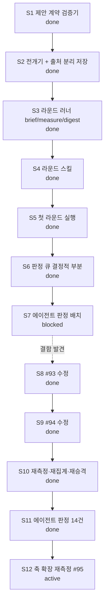

# Current Plan

**Status**: Active control document
**Policy**: [Workflow Governance](WORKFLOW-GOVERNANCE.md)
**History index**: [HISTORY-MAP.md](HISTORY-MAP.md)
**Integration branch**: `main`

This is the single live work-control document for the current repository lane. The structure of this file is enforced by `docs/WORKFLOW-GOVERNANCE.md` §12 (Live-Doc Schema) and §13 (Canonical Next Step Discipline) — the guard's `checkLiveDocSchema()` will validate this file on every precommit. Sections appear in the canonical order below; do not insert new H2 sections between CORE sections (consumer-specific sections must be appended after the last CORE section).

## Active Lane

Lane: `M5-proposal-rounds`

M5(3층 제안) — 반사실 캠페인의 창의 층. **무인 라운드 배치**로 짓는다: 사람이 루프의
동력이면 ①노가다 ②탐색이 사람 머릿속 상한에 갇힘 ③사용량에 기대면 축적 빈약, 셋이
무너진다(사용자 지시 2026-08-20). M3 캠페인을 수십 시간 무인으로 돌린 것과 같은 형태다.

사람은 **판정자**로만 남는다 — 정본 진입은 M6 큐레이션 게이트뿐이라 라운드가 아무리
돌아도 정본은 안 움직인다. 상세 설계는 [ROADMAP §M5 확정 설계](ROADMAP.md).

## Status Graph



## Baseline Structure

### M5-proposal-rounds

Status: `active`

Lane scope: 제안을 무인 배치로 생성·측정하고, 사람은 다이제스트만 판정한다.

| Sub | Subject | Status |
| --- | --- | --- |
| S1 | 제안 계약 검증기 — 3필드 강제·갭 라벨 (`engine/proposal.py`) | done |
| S2 | 전개기 + 출처 분리 저장 (`engine/proposal_flow.py`) | done |
| S3 | 라운드 러너 — brief·measure·digest (`engine/proposal_round.py`) | done |
| S4 | 라운드 스킬 `skills/proposal-round/` + 등록 shim | done |
| S5 | 첫 라운드 실행 → 다이제스트 판정 | done |
| S6 | 판정 큐 — 제공 축 분류·요구 기재·측정 경로 (결정적) | done |
| S7 | 에이전트 판정 배치 — 4건 시행 후 **중단**(측정 결함 발견) | blocked |
| S8 | #93 `<Slot active>` 수정 + 통합 시험 | done |
| S9 | #94 수정 — 오염 포함본 병기(`with_tainted`) | done |
| S10 | 재측정(2,689벌) → 재집계 → NodeValue 재승격 | done |
| S11 | 에이전트 판정 14건 — 큐 결함 3건·도구 결함 2건 발견 | done |
| S12 | #95 측정 축 13개로 재측정 → 재집계 | active |

## Canonical Next Step

The only next executable step is: **확장한 13개 축으로 캠페인을 재측정한다 (S12, #95).**

## Deferred Candidates

Pre-promotion lane candidates and Tier-4 follow-ups belong in a project-specific work backlog (e.g., `docs/WORK-BACKLOG.md`), not in this file. Replace this section's contents with a short list of named candidates when they exist:

```markdown
- `BI-feature-y` — short description (estimated effort, prerequisite, target version unassigned).
- `BI-feature-z` — short description.
```

This section is RECOMMENDED in `between-lanes` state (operators looking for "what's next" should find candidates here).

## Alternate Governance Actions

OPTIONAL. Use this section when the lane has named alternative paths beyond the Canonical Next Step (e.g., pause, fallback to a different lane, scope-extend). Each entry should name the alternative + when it would be chosen.

In the install state, the only alternative is "wait for a lane to be defined." No entry needed yet.

## Cleanup / Worktree Disposition

| Item | Status | Disposition |
| --- | --- | --- |
| `artifacts/ingest-raw/proposals/0-5/` | active | 데이터 repo — 제안·전개·측정(파생). 정본 아님, 유지 |
| `artifacts/ingest-raw/counterfactual/0-5/removals-pre87/` | keep | #87 수정 전 1차분 — 대조·감사용 보관 |
| scratchpad `m4final`·`m4v2`·`m4v3` | disposable | 집계 대조용 임시 — 레인 종료 시 폐기 |
| worktree `.claude/worktrees/arc-measure` | unknown | 다른 세션 소유 추정 — **임의 삭제 금지**, 소유 세션 확인 후 처리 |
| worktree `.claude/worktrees/ecstatic-benz-b4d93c` | unknown | 위와 같음 |
| worktree `.claude/worktrees/zealous-dewdney-e94861` | unknown | 위와 같음 |
| branch `feat/m5-proposal-contract` | active | 이 레인의 작업 브랜치 — 머지 후 삭제 |
| branch `feat/long-jump-bundles` | unknown | 다른 세션 소유 추정 — 확인 후 처리 |

## Open Decisions

| Decision | Outcome | Date |
| --- | --- | --- |
| M5를 사람 트리거가 아니라 무인 라운드 배치로 | 배치 확정 — 사람은 판정자로만 | 2026-08-20 |
| 제안 3필드(메커니즘·전제·검증 경로)를 문서가 아니라 검증기로 강제 | `engine/proposal.py` | 2026-08-20 |
| 검증 경로 없는 제안을 배제하지 않고 **갭 라벨**로 보존 | 라벨 누적 = 다음 측정기 우선순위 | 2026-08-20 |
| 유형 할당량으로 스태킹 쏠림 방지 (가로등 밑 열쇠 찾기) | `TYPE_QUOTA` | 2026-08-20 |
| M4.5(메커니즘 그룹 조건)는 보류 — 홀드아웃 일반화 실패 | BACKLOG #89 · 재료 보존 | 2026-08-19 |
| 「측정 0 = 가치 없음」 전제 폐기 — 축을 못 잡은 것으로 재해석 | #92 · habit 판정 봉인 | 2026-08-20 |
| 기계적으로 안 되는 판정은 **에이전트**가 근거를 찾아 수행 (사용자에게 미루지 않음) | 근거 경로 필수 | 2026-08-20 |
| 에이전트 판정 배치를 중단하고 측정 결함부터 수정 | #93·#94 — 오염된 큐로 판정하면 판정도 오염된다 | 2026-08-20 |
| #94는 제외 대신 **병기**(with_tainted) — 축 단위 제외는 기각 | 주얼이 어느 축에 얹었는지 모르는 경우가 많다 | 2026-08-20 |
| 측정 축을 3 → 13개로 확장 | #95 — PoB가 이미 내보내는 값을 안 읽어 계열 전체가 0이었다 | 2026-08-21 |
| PoB 모델 갭 3건은 조치 불가로 기록만 | #96 — Jade·플라스크 가동률·투사체 수 | 2026-08-21 |
| Integration branch override — 작업 브랜치 `feat/m5-proposal-contract` | 레인명(`M5-proposal-rounds`)과 다름. 레인 승격 **전에** 브랜치를 열었고 PR이 이 이름으로 진행 중이라 유지. 이 레인 한정, 머지 시 소멸 | 2026-08-20 |

## Explicit Non-Actions

- Do not treat old roadmaps, drafts, or spike write-ups as active control unless this document explicitly reactivates them.
- Do not delete project documents before durable facts are absorbed into `HISTORY-MAP.md` or a closure artifact.
- Do not assign a release/version label to a lane up front; version assignment happens at release composition (`release compose`).
- Do not insert new H2 sections between the 9 CORE sections above (would fail the guard's `section-unknown-interleaved` check). Consumer-specific sections may be appended after `## Explicit Non-Actions`.
