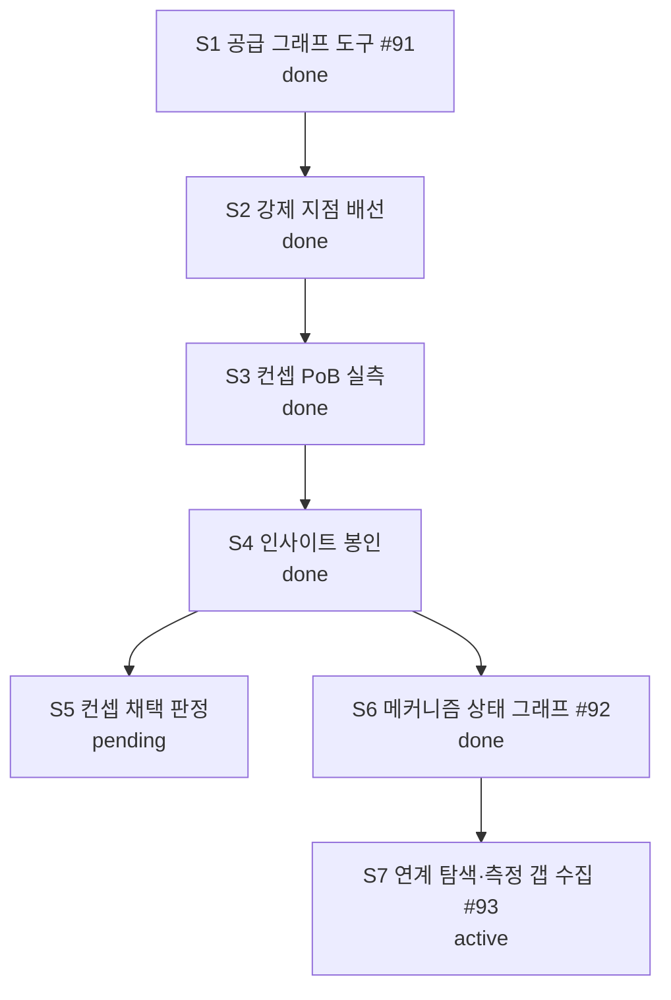

# Current Plan

**Status**: Active control document
**Policy**: [Workflow Governance](WORKFLOW-GOVERNANCE.md)
**History index**: [HISTORY-MAP.md](HISTORY-MAP.md)
**Integration branch**: `main`

This is the single live work-control document for the current repository lane. The structure of this file is enforced by `docs/WORKFLOW-GOVERNANCE.md` §12 (Live-Doc Schema) and §13 (Canonical Next Step Discipline) — the guard's `checkLiveDocSchema()` will validate this file on every precommit. Sections appear in the canonical order below; do not insert new H2 sections between CORE sections (consumer-specific sections must be appended after the last CORE section).

## Active Lane

Lane: `BI-stacking-axis-exploration`

스태킹 축 탐색 레인 — 공급 그래프 도구(#91, PR #86 머지 완료)를 만들고, 그 도구로
전도성 룬·코스트 스태킹 컨셉을 PoB 실측까지 검증해 결과를 정본 인사이트로 봉인한다.
컨셉 채택 여부(계속 팔 것인가)는 사용자 게임 지식 판정 대기 중이다.

Per §8 (Git and Worktree Hygiene), this lane targets the integration branch named in the header (`main` by default). If a different base is required, add an entry to `## Open Decisions` named "Integration branch override" with the override branch name, reason, and duration (single lane / until stated condition).

## Status Graph



## Baseline Structure

### BI-stacking-axis-exploration

Status: `active`

Lane scope: 스태킹 축을 도구로 발견하고, 나온 컨셉을 PoB 실측으로 검증해 정본에 봉인한다.

| Sub | Subject | Status |
| --- | --- | --- |
| S1 | 공급 엣지 스캔·사슬 순회 도구 (#91) — `scan_supply_edges`/`trace_chains` | done |
| S2 | 강제 지점 4곳 배선 (0건 진단·AGENTS·스킬·서버 instructions) | done |
| S3 | 컨셉 PoB 실측 (전도성 룬 배율표·코스트 스태킹 대조·천장 측정) | done |
| S4 | 실측 결과 인사이트 봉인 (`insight.conductive-runes-and-cost-stacking`) | done |
| S5 | 컨셉 채택 판정 — 계속 팔 것인가 (사용자 게임 지식 게이트) | pending |
| S6 | 메커니즘 상태 그래프 (#92) — vocab v2 + `scan_state_edges`/`trace_mechanism_chains` | done |
| S7 | 그래프로 연계 탐색 + 측정 갭 수집 (#93 「개수 배수」 계열 등재) | done |

S1~S2는 PR #86, S4는 PR #89로 머지됨. S5는 판정 대기이므로 세션이 진행할 수 없다(AD-3).
S5(전도성 룬 컨셉)는 사용자가 기각 방향으로 판단했고, 탐색은 S6의 새 그래프로 이어간다.

## Canonical Next Step

The only next executable step is: **메커니즘 상태 그래프(#92)가 낸 전이 25종·사슬 33개에서 다음 탐색 컨셉을 사용자와 고른다.**

S6 산출물이 판정 재료다: `Snap`(원소 상태이상 → 주입+잔류물 변환기) · `Disengage`
(패리 → 충전) 같은 전이가 나왔고, 생산자 없는 축 4종(격노·부서진 방어구·연소·패리)은
수집 갭인지 어휘 갭인지 판정이 필요하다. 어느 사슬을 팔지는 게임 지식 게이트다(AD-3).

## Deferred Candidates

Pre-promotion lane candidates and Tier-4 follow-ups belong in a project-specific work backlog (e.g., `docs/WORK-BACKLOG.md`), not in this file. Replace this section's contents with a short list of named candidates when they exist:

```markdown
- `BI-feature-y` — short description (estimated effort, prerequisite, target version unassigned).
- `BI-feature-z` — short description.
```

This section is RECOMMENDED in `between-lanes` state (operators looking for "what's next" should find candidates here).

## Alternate Governance Actions

OPTIONAL. Use this section when the lane has named alternative paths beyond the Canonical Next Step (e.g., pause, fallback to a different lane, scope-extend). Each entry should name the alternative + when it would be chosen.

In the install state, the only alternative is "wait for a lane to be defined." No entry needed yet.

## Cleanup / Worktree Disposition

| Item | Status | Disposition |
| --- | --- | --- |
| (none yet) | — | Record temporary worktrees, generated outputs, scratch files, and similar candidates here as they are created. Per §8 these must be resolved before lane closure. |

## Open Decisions

| Decision | Outcome | Date |
| --- | --- | --- |
| Integration branch override | `insight/conductive-runes-cost-stacking` 브랜치에서 작업 — 협업 규율상 main 직접 커밋 금지(AGENTS.md §협업 1), PR로 머지한다. 이 레인 한정. | 2026-08-20 |
| 코스트 스태킹 컨셉 | **조건부 기각** — 동일 생명 예산에서 완드+래스피스에 x2.0~3.2 열세(슬롯 기회비용). 재평가 조건: 코스트 배수 합산 x2.5+ 확인 또는 +레벨급 코스트 무기 등장 | 2026-08-20 |
| 로우라이프 연계 | **제외** — 문턱 35% vs 시전당 코스트 10~17%로 산술 불성립. 판정 시점 논쟁은 이 산수로 무의미 | 2026-08-20 |
| 묠니르-전도성 룬 연계 | **불가 확정** — 천둥신의 진노 에너지 조건이 Melee 적중인데 전도성 룬에 Melee 타입 없음. 묠니르는 +레벨 스탯막대로만 가치 | 2026-08-20 |

## Explicit Non-Actions

- Do not treat old roadmaps, drafts, or spike write-ups as active control unless this document explicitly reactivates them.
- Do not delete project documents before durable facts are absorbed into `HISTORY-MAP.md` or a closure artifact.
- Do not assign a release/version label to a lane up front; version assignment happens at release composition (`release compose`).
- Do not insert new H2 sections between the 9 CORE sections above (would fail the guard's `section-unknown-interleaved` check). Consumer-specific sections may be appended after `## Explicit Non-Actions`.
