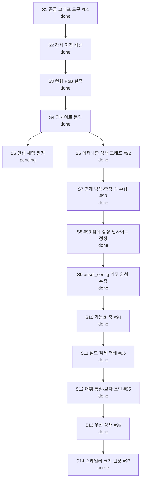

# Current Plan

**Status**: Active control document
**Policy**: [Workflow Governance](WORKFLOW-GOVERNANCE.md)
**History index**: [HISTORY-MAP.md](HISTORY-MAP.md)
**Integration branch**: `main`

This is the single live work-control document for the current repository lane. The structure of this file is enforced by `docs/WORKFLOW-GOVERNANCE.md` §12 (Live-Doc Schema) and §13 (Canonical Next Step Discipline) — the guard's `checkLiveDocSchema()` will validate this file on every precommit. Sections appear in the canonical order below; do not insert new H2 sections between CORE sections (consumer-specific sections must be appended after the last CORE section).

## Active Lane

Lane: `BI-stacking-axis-exploration`

스태킹 축 탐색 레인 — 공급 그래프 도구(#91, PR #86 머지 완료)를 만들고, 그 도구로
전도성 룬·코스트 스태킹 컨셉을 PoB 실측까지 검증해 결과를 정본 인사이트로 봉인한다.
컨셉 채택 여부(계속 팔 것인가)는 사용자 게임 지식 판정 대기 중이다.

Per §8 (Git and Worktree Hygiene), this lane targets the integration branch named in the header (`main` by default). If a different base is required, add an entry to `## Open Decisions` named "Integration branch override" with the override branch name, reason, and duration (single lane / until stated condition).

## Status Graph



## Baseline Structure

### BI-stacking-axis-exploration

Status: `active`

Lane scope: 스태킹 축을 도구로 발견하고, 나온 컨셉을 PoB 실측으로 검증해 정본에 봉인한다.

| Sub | Subject | Status |
| --- | --- | --- |
| S1 | 공급 엣지 스캔·사슬 순회 도구 (#91) — `scan_supply_edges`/`trace_chains` | done |
| S2 | 강제 지점 4곳 배선 (0건 진단·AGENTS·스킬·서버 instructions) | done |
| S3 | 컨셉 PoB 실측 (전도성 룬 배율표·코스트 스태킹 대조·천장 측정) | done |
| S4 | 실측 결과 인사이트 봉인 (`insight.conductive-runes-and-cost-stacking`) | done |
| S5 | 컨셉 채택 판정 — 계속 팔 것인가 (사용자 게임 지식 게이트) | pending |
| S6 | 메커니즘 상태 그래프 (#92) — vocab v2 + `scan_state_edges`/`trace_mechanism_chains` | done |
| S7 | 그래프로 연계 탐색 + 측정 갭 수집 (#93 등재) | done |
| S8 | #93 범위 2회 정정 + 인사이트 정정 (검증으로 뒤집힌 보고 §3 등재) | done |
| S9 | #93 원인 규명·수정 — `unset_config` 거짓 양성(극성·승수형 의미) | done |
| S10 | 가동률(uptime) 축 신설 (#94) — 지속/쿨다운 정합을 엔진에 | done |
| S11 | 월드 객체 연쇄 (#95) — #92 확장, 객체 축 15종·전이 27종 신규 | done |
| S12 | 축 어휘 통일 + 3층 교차 조인 (#95) — 공유 축 2→7종, `crosswalk.py` | done |
| S13 | 우산 상태 (#96) — 상위 상태 전파·부정문 공통 관문·고정 축 신설 | done |
| S14 | 스케일러 크기 판정 (#97) — `scan_scalers` 네 축 분해·프록시 귀속·획득 관문 | done |

S1~S2는 PR #86, S4는 PR #89로 머지됨. S5는 판정 대기이므로 세션이 진행할 수 없다(AD-3).
S5(전도성 룬 컨셉)는 사용자가 기각 방향으로 판단했고, 탐색은 S6의 새 그래프로 이어간다.

## Canonical Next Step

The only next executable step is: **고친 필터(`scan_scalers`)로 곱연산 축을 다시 훑어 다음 빌드 컨셉을 고른다.**

S14가 만들어진 계기: `per Power` 탐색에서 **같은 오독을 세 번 연속** 냈다(#97) — 담체
개수를 배율 크기로 착각. 이제 `scan_scalers`가 `payoff_kind`·`cap`·`attribution`·
`obtainable` 넷으로 갈라 주므로, **`kind="more"` + `attribution!="player"` + 상한 없음**을
필터로 걸고 축 전수를 다시 돌리는 것이 다음 탐색의 출발점이다.

⚠ 다음 탐색 전에 #98(정본에 무기 계열 제약 없음)을 기억할 것 — 도구가 통과시켜도
**빌드 전제(무기·전직·슬롯)는 사용자 확인이 필요하다**. 이번에 육척봉 전용 스킬을
철퇴 빌드 핵심으로 설계해 컨셉을 두 번 다시 짰다.

판정은 사용자 게임 지식 게이트다(AD-3).

## Deferred Candidates

Pre-promotion lane candidates and Tier-4 follow-ups belong in a project-specific work backlog (e.g., `docs/WORK-BACKLOG.md`), not in this file. Replace this section's contents with a short list of named candidates when they exist:

```markdown
- `BI-feature-y` — short description (estimated effort, prerequisite, target version unassigned).
- `BI-feature-z` — short description.
```

This section is RECOMMENDED in `between-lanes` state (operators looking for "what's next" should find candidates here).

## Alternate Governance Actions

OPTIONAL. Use this section when the lane has named alternative paths beyond the Canonical Next Step (e.g., pause, fallback to a different lane, scope-extend). Each entry should name the alternative + when it would be chosen.

In the install state, the only alternative is "wait for a lane to be defined." No entry needed yet.

## Cleanup / Worktree Disposition

| Item | Status | Disposition |
| --- | --- | --- |
| (none yet) | — | Record temporary worktrees, generated outputs, scratch files, and similar candidates here as they are created. Per §8 these must be resolved before lane closure. |

## Open Decisions

| Decision | Outcome | Date |
| --- | --- | --- |
| Integration branch override | `insight/conductive-runes-cost-stacking` 브랜치에서 작업 — 협업 규율상 main 직접 커밋 금지(AGENTS.md §협업 1), PR로 머지한다. 이 레인 한정. | 2026-08-20 |
| 코스트 스태킹 컨셉 | **조건부 기각** — 동일 생명 예산에서 완드+래스피스에 x2.0~3.2 열세(슬롯 기회비용). 재평가 조건: 코스트 배수 합산 x2.5+ 확인 또는 +레벨급 코스트 무기 등장 | 2026-08-20 |
| 로우라이프 연계 | **제외** — 문턱 35% vs 시전당 코스트 10~17%로 산술 불성립. 판정 시점 논쟁은 이 산수로 무의미 | 2026-08-20 |
| 묠니르-전도성 룬 연계 | **불가 확정** — 천둥신의 진노 에너지 조건이 Melee 적중인데 전도성 룬에 Melee 타입 없음. 묠니르는 +레벨 스탯막대로만 가치 | 2026-08-20 |
| 냉기 주입 순환 컨셉 | **성립 가능 · 보류** — 수지·발동률 모두 흑자로 계산됨. 진행 전 해결 과제는 **쿨다운 병목 하나**(아래 §보류 컨셉 참조). 재개 조건: 쿨다운 회복 예산 100%+ 확보 경로 확인 | 2026-08-21 |
| 자로크의 봉기 컨셉 | **보류** — 쿨다운 10초가 최대 병목. 회복 265%로 상쇄하려면 무기·목걸이까지 유니크 강제라 슬롯 손실이 큼. 재평가 조건: 쿨다운 회복이 **다른 축과 공유**되는 구성 발견 시(냉기 주입 순환이 그 사례) | 2026-08-20 |

## Explicit Non-Actions

- Do not treat old roadmaps, drafts, or spike write-ups as active control unless this document explicitly reactivates them.
- Do not delete project documents before durable facts are absorbed into `HISTORY-MAP.md` or a closure artifact.
- Do not assign a release/version label to a lane up front; version assignment happens at release composition (`release compose`).
- Do not insert new H2 sections between the 9 CORE sections above (would fail the guard's `section-unknown-interleaved` check). Consumer-specific sections may be appended after `## Explicit Non-Actions`.

## 보류 컨셉 (탐색 산출물)

빌드 설계 본체는 `artifacts/builds/<id>/design.md`(gitignore·미보존)라 사라진다. 여기에는
**다시 집어들 수 있을 만큼의 골자와 재개 조건만** 남긴다. 판정은 사용자 게임 지식 게이트다(AD-3).

### 냉기 주입 순환 (Ice Nova · CoEA×2 · Snap · 으스스한 기둥) — 2026-08-21

**한 줄**: 빙결 1회가 메타 젬 에너지·주입 잔류물·얼음 수정 기폭을 **동시에** 켜는 보스 특화 순환.

**배치** — 버튼 1~2개, 정신력 230 고정비

| 자리 | 담체 | 역할 |
| --- | --- | --- |
| 손 | Ice Nova (+얼음화살 병용) | 빙결 담당 · 냉기 주입 **소비자** · `Verglas` 부착처 |
| CoEA #1 (100) | **Snap** | 빙결 소모 → 얼음 수정 일제 기폭 + 잔류물 생성 + 유니크 50% more |
| CoEA #2 (100) | **Grim Pillars** | 룬 수호 소모 → 얼음 수정 8개 (상한 20) |
| 상시 (30) | Siphon Elements | 빙결마다 냉기 잔류물 (Power 20 → 100%) |

CoEA 2개는 `Absent Amulet`(변형 1)로 하나를 더 얻는다 — 대가는 접두·접미 각 −1.

**⛔ 최대 병목 — 쿨다운. 이걸 풀어야 Snap이 원활히 돈다.**

Snap의 기본 쿨다운 **4초**가 순환 전체의 회전수를 정한다. Snap이 빙결을 **걷어내야**
재빙결이 가능하므로(빙결은 중첩 불가·기본 4초), **빙결 주기 = Snap 주기**다. 즉 Snap이
느리면 공급·발동·버프가 **한꺼번에** 느려진다:

| 쿨다운 회복 | Snap 주기 | 냉기 잔류물/초 | +추가생성 40% | Archon 가동률 |
| ---: | ---: | ---: | ---: | ---: |
| 0% | 4.00초 | 0.50 | 0.70 | 50% |
| **100%** | 2.00초 | 1.00 | **1.40** | **100%** |
| 200% | 1.33초 | 1.50 | 2.10 | 100% |
| 265% | 1.10초 | 1.83 | 2.56 | 100% |

수요는 Ice Nova 냉기 1개/시전 = 1.00/초(기본 시전 1.0초). **쿨다운 회복 100% 미만이면
주입이 적자**고, 100%에서 흑자로 돌아서면서 `Elemental Archon`도 동시에 상시화된다.

이 축 하나가 네 곳에 걸린다: ①Snap 주기(공급률) ②빙결 빈도(CoEA 에너지) ③Archon 가동률
④Frost Bomb 쿨다운. 자로크의 봉기에서 "쿨다운 회복은 스킬 하나에만 걸려 값어치 없다"고
기각했던 것과 **정반대 구조**다.

**계산 근거 (도구 실측 2026-08-21)**

- `compute_trigger_rate`: CoEA는 동결에 **Power당 10 에너지**(감전·점화는 1). 유니크는 Power
  고정 20이라 빙결 1회 = **230 에너지**(품질 +15%). 소켓 2.6초(최대 260)도 매 빙결마다 찬다.
  일반 몹은 11.5/빙결이라 팩 AoE로 벌충한다 — **맵핑이 약하고 보스가 강한** 비대칭.
- `uptime`: Archon 지속 10초 / 회복주기 20초 → `required_cooldown_recovery` = **+100%**.
- 룬 수호는 병목이 **아니다**(초기 판단 철회): 정본 담체 조립 시 최대 2,355 → 재생 118/초,
  기둥 비용 81 → **초당 1.45회**(재생 접사 포함 2.18~2.91). 팩·희귀 발동률을 덮는다.

**아직 안 쓰이는 축 3종** (이 컨셉의 실제 신규성)

1. **얼음 수정 최대 생명력**이 숨은 딜 스탯 — `Verglas`가 *"파괴한 수정 최대 생명력 2,000당
   피해의 1%를 추가 냉기로"*. 기둥 만렙 9,536 × `Glacier`(100% more) × `Ice Walls`(200% inc)
   → 개당 **28~33%**. ⚠ 기둥 20개 **누적 여부는 정본에 없다(미판정)**.
2. **룬 수호 비용이 양방향 축** — `Verisium`은 *비어 있는 동안* 추가 화염 42~52%, 별도 접사는
   *비용 50당* 추가 번개 4~6%. 반대로 `Explosive Transmutation`은 비용 효율 +30%. CoEA가
   룬 수호를 자동으로 비우는 게 결함이 아니라 **기능**이다.
3. **주입 이종 강제** — 소비자 대부분이 다른 원소를 먹는다(스파크←냉기, 혜성←화염, 아크←번개).
   `Refracted Infusion`(수집 시 **다른** 원소 확정 1개)이 이 족쇄를 풀고, 잉여 이종은 CoEA
   소켓에 혜성·아크를 함께 넣어 소비한다(보스는 에너지 과잉이라 소켓 증설이 공짜).

**미검증 (진행 전 확인 필요)**

- `Verglas`는 *"Skills **you use yourself**"* — CoEA 트리거 Snap에는 안 붙을 수 있다.
  그래서 Verglas는 **Ice Nova에 붙이고 노바가 수정을 깨야** 한다는 게 현재 판단.
  (`Olroth's Hubris`·`Runic Infusion`은 *"use or Trigger yourself"*로 트리거를 **명시** —
  이 문구 차이가 판정 근거다.)
- 기하: 기둥은 **내 주변 4m**, Snap 적 폭발은 **적 위 1.6m**. 두 원이 겹쳐야 기폭된다 →
  밀착 시전 또는 Snap AoE 확장 필요.
- 기둥 *"80% less damage if destroyed within 0.5 seconds by something other than you"* —
  **사용자 확인 완료(2026-08-21): CoEA로 시전한 Snap은 「자기 자신」으로 판정된다. 문제 없음.**
- 벨트 3접두(`Glacial`/`Erupting`/`Energising`, 각 41~59%·서로 다른 group이라 공존 가능)는
  **PoB가 못 읽는다**(`pob_modeling.supported: false`) — `substitutes`로 추산해야 한다.
- 보스 빙결 축적을 목표 주기로 채울 수 있는지 **미측정**.

**재개 조건**: 쿨다운 회복 100%+ 예산이 다른 슬롯을 과하게 잡아먹지 않고 서는지 확인.
그다음이 얼음 수정 생명력 → `Verglas` 환산 실측.

### 몽크·철퇴 탐색 (Power 스태킹) — 2026-08-22 · **척추 불성립으로 보류**

**결론**: `Sadist's Mercy`의 Gruelling Madness(적 Power +10)는 **작동하지만 빌드 척추가
못 된다.** Power를 읽는 페이오프가 (a)대부분 게이지·횟수이고 (b)딜 계열은 `player` 귀속이라
공허의 형상에서 차단되며 (c)상한에 걸린다. `scan_scalers` 실측: `per Power` 곱연산 5건 중
3건이 프록시 차단, 배제 2건(`unused`·`carrier_unknown`).

**그래도 살릴 값어치가 있는 것** (Power와 무관하게 그 자체로 좋음):
- `Sadist's Mercy` — 물리 240~300% · 기본 치명타 13%급 · APS 1.8 (한손 철퇴)
- `Way of the Stonefist`(무술가) — 장갑을 돌주먹으로 변환: 카오스 **%전환**(고정 아님) ·
  레벨당 회피+3/ES+1 · 맹공 · 속성 요구 면제. **핵심 아이템을 강화하는 노드**
- `Way of the Mountain`(무술가) — **받는 피해 40% less**(Power는 중첩 수만 정함, 상한 30)
- `Hollow Form`(무술가) — 무기 스탯을 그대로 복사하는 딜 배수기. 사용자 실측: **사용감 좋음**,
  시전시간 긴 스킬일수록 이득(이미지가 코스트 80%로 대신 시전)
- 마무리 타격 임계치 — 보스 실효 딜 ×1.2~1.44 (전량 투자 시 유니크 4개 필요)

**확정된 사실 (인게임 실측)**:
- 공허의 형상: **무기 귀속 옵션은 통과**(Gruelling Madness 10/10 확인), **플레이어 귀속은
  차단**(광기의 선구자 발동 안 함)
- `Crushing Fear`는 **육척봉 전용** — 철퇴와 배타 (#98)
- 마무리 타격은 **유니크에도 걸린다**(임계 5%) · 단 일부 스크립트 보스는 예외
- `Glacial Cascade`는 **끝점 조준 문제로 실전성 낮음** — 범위(AoE)로 못 당기고,
  현재 버전이 근처 적을 강제 조준해 `Frozen Locus` 콤보를 방해한다(공식 포럼 불만 확인)

**재개 조건**: 「Power를 곱연산으로 바꾸는 담체」가 새로 나오면(시즌 갱신 등).
그전까지는 위 목록을 **평범하지만 저점 높은 무술가 철퇴 빌드**의 재료로만 쓴다.
