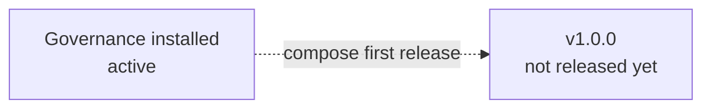

# Project History Map

**Status**: Active history index
**Policy**: [Workflow Governance](WORKFLOW-GOVERNANCE.md)

This file is a thin release/version index and timeline. It records durable release/version outcomes only after completed work has been composed into a versioned bundle. Active workflow state belongs in [`CURRENT-PLAN.md`](CURRENT-PLAN.md); completed-but-unreleased workflow evidence belongs under `## Unreleased Workflow Evidence` below until release composition absorbs it. The structure of this file is enforced by `docs/WORKFLOW-GOVERNANCE.md` §12.2 (Live-Doc Schema) — the guard's `checkLiveDocSchema()` validates section order and required content on every precommit.

## Canonical References

- Workflow policy: [WORKFLOW-GOVERNANCE.md](WORKFLOW-GOVERNANCE.md)
- Current active work: [CURRENT-PLAN.md](CURRENT-PLAN.md)

## Timeline



Version entries appear here as bare H3 headings (`### vX.Y.Z`) immediately after the Timeline Mermaid block and before `## Unreleased Workflow Evidence`. Per §12.2 the validator scans `/^### v\d+\.\d+\.\d+/` within this positional range — newest version first. Each version entry MUST contain a `Status:` line and a `Composed milestones:` line (per §3 Composed Milestones Convention).

Example shape (remove this prose block once the first real release is composed by `release compose`):

```markdown
### v1.0.0

Status: `released YYYY-MM-DD`

Summary:
- One-to-three-line durable outcome summary naming the user-visible result and the verification basis.

Composed milestones: BI-feature-x, BI-feature-y, BI-feature-z
```

## Unreleased Workflow Evidence

Completed workflow evidence that has not yet been composed into a release version is listed here as one bullet per closed lane until the next `release compose` absorbs them.

Empty by default. Populate when a lane closes without immediate release composition. Example shape:

```
- BI-feature-x closure archive: [`artifacts/20-milestones/BI-feature-x/closure-archive-YYYY-MM-DD.md`](../artifacts/20-milestones/BI-feature-x/closure-archive-YYYY-MM-DD.md)
```

## Backlog Pointer

Unstarted and version-unassigned work candidates may live in a project-specific work backlog file (e.g., `docs/WORK-BACKLOG.md`) or in the `## Deferred Candidates` section of `CURRENT-PLAN.md`. Whichever location is used, this section names where to look. Update this pointer when the project's backlog location changes.

By default: no separate backlog file; deferred candidates live in `CURRENT-PLAN.md` `## Deferred Candidates`.

## Deferred / Candidate Lanes

OPTIONAL. Use this section when there are known-but-not-promoted lane candidates whose existence is durable enough to belong in the history map (e.g., long-deferred lanes preserved across releases). For routine pre-promotion candidates, prefer `CURRENT-PLAN.md` `## Deferred Candidates`.

| Lane | Status | Summary |
| --- | --- | --- |
| (none yet) | — | Record durable deferred lanes here. |

## Cleanup Notes

OPTIONAL. Use this section to record document or artifact reorganization events that affect cross-references (e.g., milestone artifact directory flattening per §10 Artifact Layout, schema migrations across versions, removal of obsolete control documents). Each entry should be 1-3 lines with the date and a pointer to the responsible commit or closure archive.

Empty by default. Populate when such an event occurs.
